# Практика 10
# Часть A. Подготовка и вёрстка
## 1. Столбец password_hash
### 01-describe.png
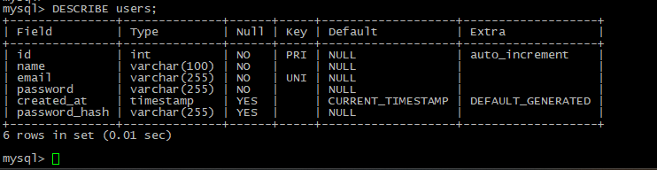\
Почему VARCHAR(255), а не VARCHAR(60)? 
password_hash задан через Bcrypt. Одна такая строка получается в 60 символов, но берём с запасом на случай изменений стандартов 
Что бы произошло если сделать VARCHAR(50)? 
Произошло бы переполнение переменной, в следствии чего - ошибка. 
## 2. Partials
### 02-nav-guest.png
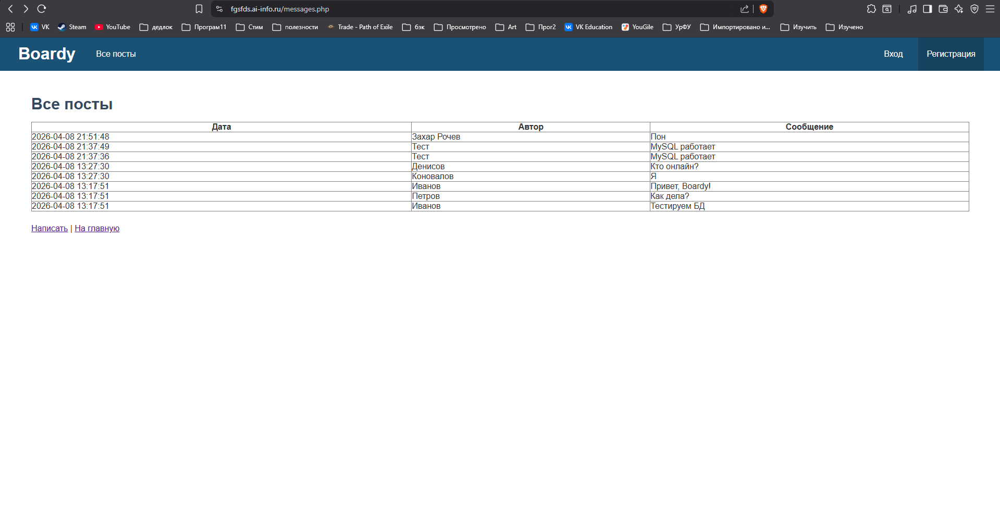
### 03-nav-logged.png
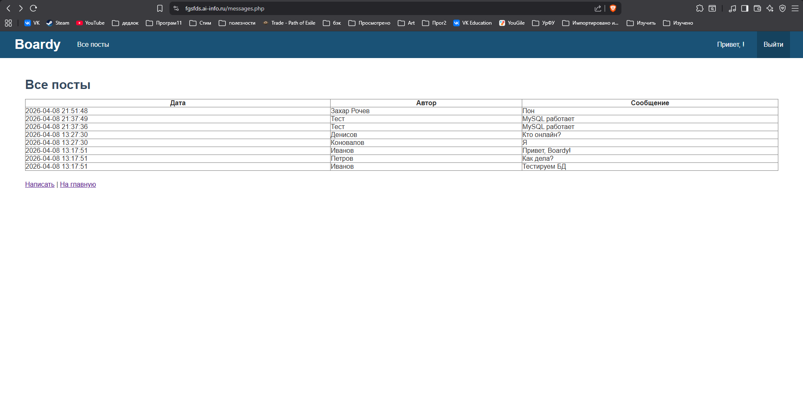\
В отчёте: почему меню вынесено в отдельный файл? 
Меню одно на весь сайт, незачем повторять его в коде каждой страницы, легче добавлять с помощью include. 
Что изменится если добавить новую ссылку — например, «Избранное»? 
Она добавиться сразу на всём сайте, на всех страницах, это еще один из плюсов выделения меню в отдельный файл. 
## 3. POST — создать комментарий
### 04-update.png

### 05-delete.png

# Часть B. Регистрация и логин
## 4. Регистрация
### 06-register-done.png
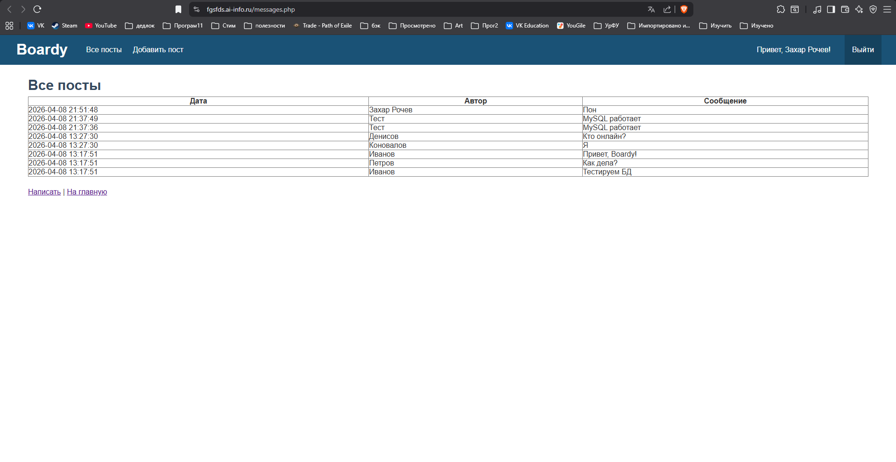
## 5. Хеш в базе
### 07-hash.png
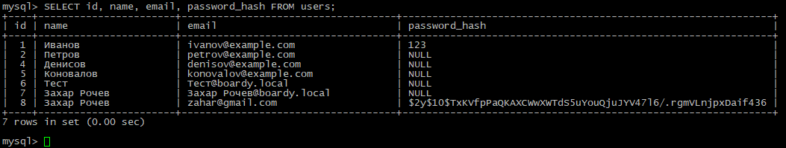
Объясните структуру хеша $2y$10$Kx8QnZq... — что означает каждая часть?  
2y - Версия алгоритма bcrypt. 
10 - cost factor: степень двойки: 2^10 = 1024 итерации хеширования. 
Далее: Соль + хеш (закодированные в Base64) Первые 22 символа - соль, остальные - хеш. 
Что произойдёт если cost factor увеличить с 10 до 15? 
Итераций станет 32 768, что увеличит время хеширования в 32 раза, то есть замедлит систему и усилит пароль. 
## 6. Защита от повторной регистрации
### 08-email-taken.png
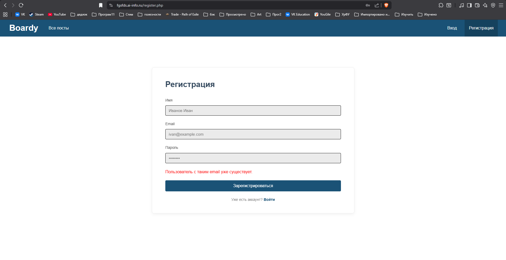\
Зачем проверять email перед INSERT? 
Чтобы не создать двух пользователей с одинаковыми email. 
Что произойдёт без этой проверки? 
Если есть UNIQUE-ограничение на столбце, будет ошибка, либо дубликат, если нет. 
## 7. Логин
### 09-login-done.png
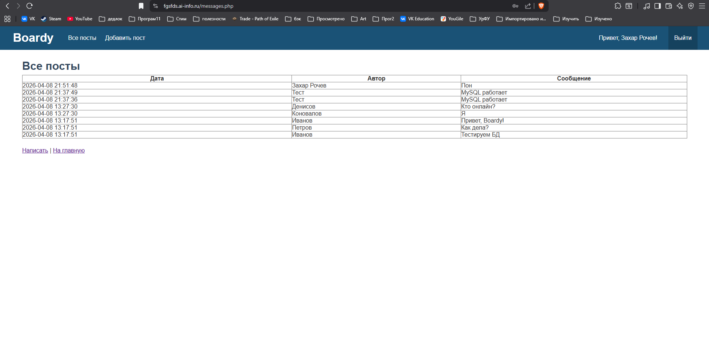
## 8. Неверный пароль
### 10-wrong-password.png
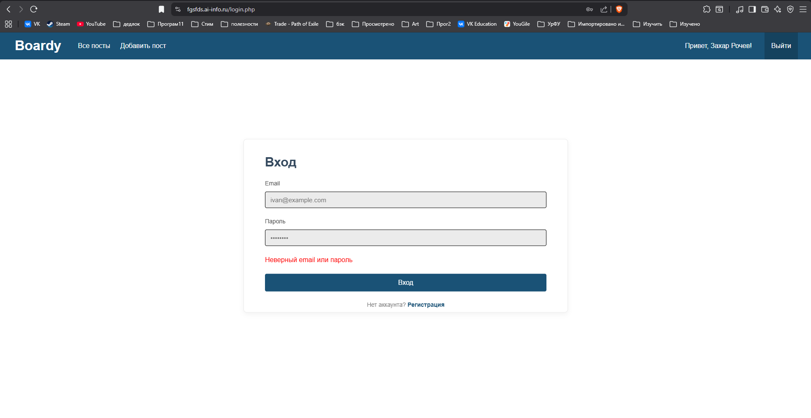\
Почему сообщение одинаковое и для "email не найден", и для "неверный пароль"? 
Если разделять эти ошибки, злоумышленники могут понять, какие email зарегестрированы в системе. 

# Часть C. Куки и сессии
## 9. Кука PHPSESSID
### 11-cookie.png
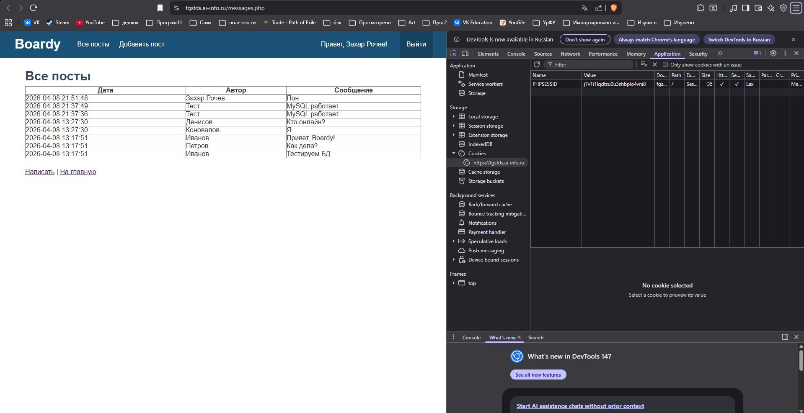\
Что хранится в значении куки? 
Только идентификатор сессии — случайная строка. 
Это пароль, имя пользователя, что-то ещё? 
Нет, это ID сессии, которую пользователь отправляет серверу и получает данные, которые хранятся на сервере. 
Откуда берётся значение? 
PHP сам генерирует уникальную случайную строку при вызове session_start() 
## 10. Параметры куки
### 12-cookie-attrs.png
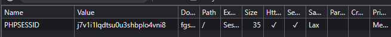\
Что изменится если убрать HttpOnly? 
Без HttpOnly — JavaScript может прочитать куку через document.cookie. 
Как это можно использовать в XSS-атаке? 
Злоумышленник может написать JS-код, который может украсть куку пользователей. 
## 11. HttpOnly на практике
### 13-httponly-check.png
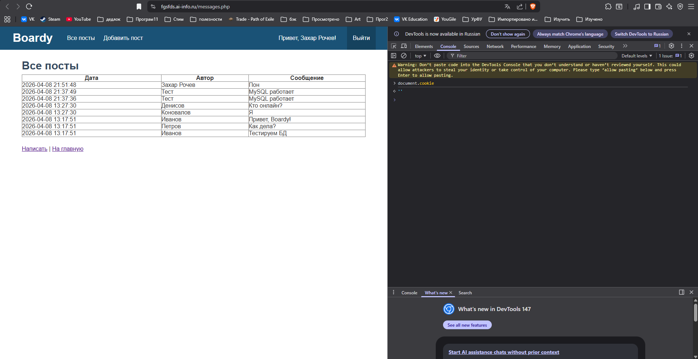
Почему PHPSESSID не видна JavaScript, хотя кука существует? 
Флаг HttpOnly скрывает куку для JS. Кука передаётся по HTTP. 
## 12. Файл сессии на сервере
### 14-source-csr.png
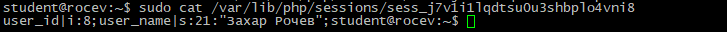\
Что хранится в файле на сервере? 
ID пользователя, его имя. Типы данных. 
Сравните с тем, что в куке. Почему данные разделены так — одно на клиенте, другое на сервере? 
Клиенту дан лишь ID сессии, который является ключом, чтобы сервер смог понять, кем является этот пользователь и отдать уже данные, которые хранятся на сервере. 
Сделано так, чтобы обезопасить пользователя и приложение: если данные будут у пользователя, их легче украсть и подделать, например, получить права администратора на сайте. 
## 13. Защита страниц
### 15-redirect.png
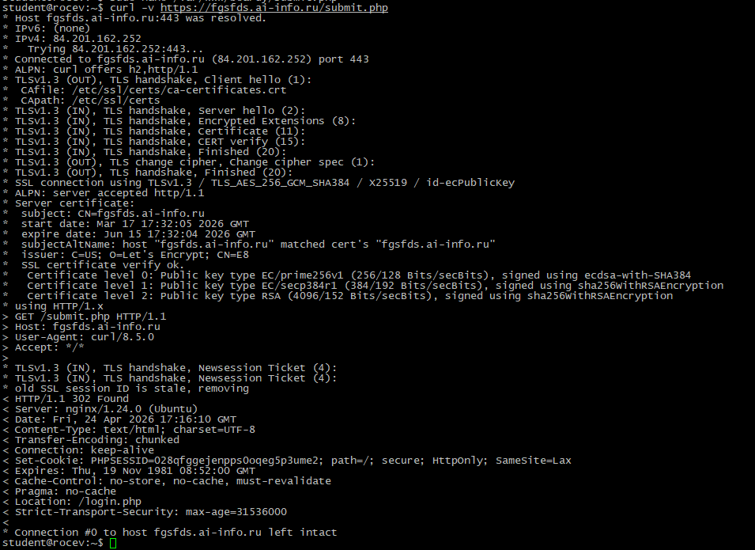\
Как vanilla JS и React защищаются от XSS? 
В vanilla JS нужно вручную вызывать функцию esc() для каждого выводимого поля,если забыть - дыра в безопасности. React автоматически всё экранирует. 
Какой способ надёжнее? 
Безусловно способ React'а надёжнее, так как каждый текст экранируется, банально невозможно забыть защититься от XSS. 
## 14. Посты с автором
### 16-posts-authors.png
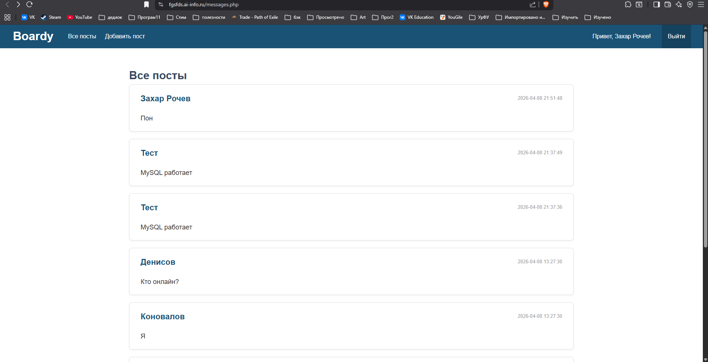\
Напишите SQL с JOIN, которым вы тянете посты. 
    SELECT p.id, p.body, p.created_at, 
           u.name AS author_name 
    FROM posts p 
    JOIN users u ON p.author_id = u.id 
    ORDER BY p.created_at DESC 
Почему JOIN, а не два отдельных запроса? 
JOIN удобнее и быстрее, так как выполняет всего один запрос в БД и если понадобится еще информация из users, можно будет дополнить прямо из JOIN. 
## 15. Добавление поста
### 17-submit-layout.png 
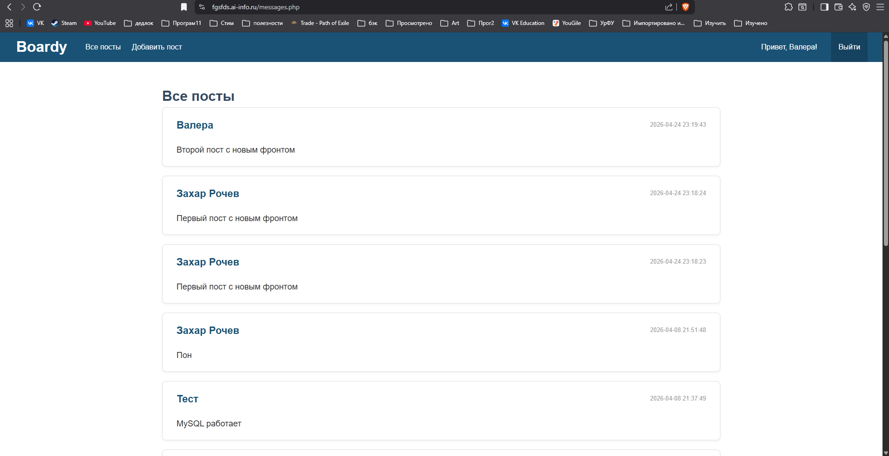
## 16. Logout
### 17-submit-layout.png 

### 19-cookie-gone.pn
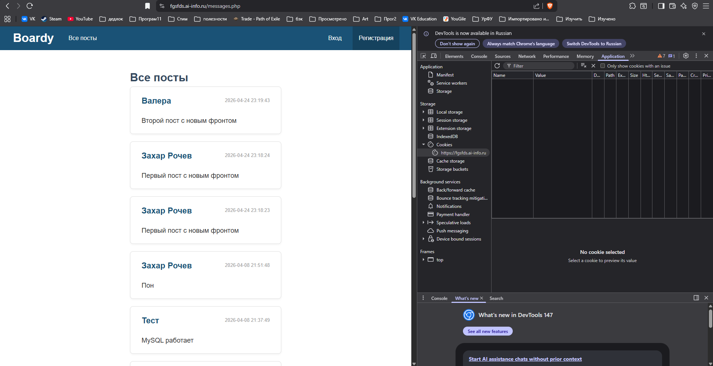\
Что делает session_destroy()? 
Удаляет файл с данными о сессии пользователя с сервера. 
Зачем ещё и setcookie() с прошедшей датой? 
Удаляет куку в браузере. 
Что останется если сделать только одно из двух? 
Если оставить куку в браузере - нет данных о пользователе на сервере, кука бесполезна. Есть файл на сервере, но нет куки в браузере - кто то может восстановить куку и украсть данные. 
## 17. Истёкшая сессия
### 20-expired.png
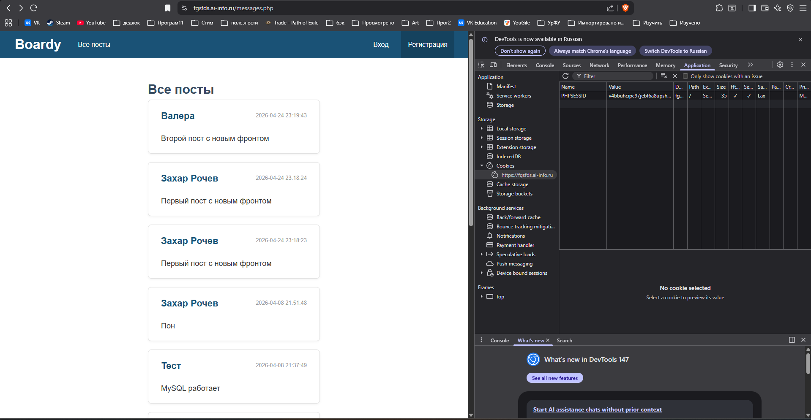\
Почему браузер считает себя залогиненным (есть кука), а сервер — нет? 
Потому что я удалил файл напрямую на сервере, браузер об этом не знает, но сервер отдаёт ничего в ответ, поэтому видно кнопку "Вход", вместо имени. 
