# Практика 11: JWT для API и OAuth через GitHub
# Часть A. JWT для API
## 1. auth.py
### 01-no-token.png
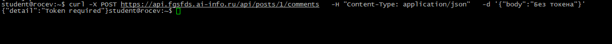\
Что означает «Bearer» в заголовке Authorization? 
Bearer (предъявитель) - это схема авторизации, которая говорит серверу: "Токен в этом запросе принадлежит тому, кто его предъявляет". 
Почему не просто «Authorization: eyJ...»? 
Без указания схемы сервер не поймёт, как интерпретировать переданную строку, так как существуют еще схемы. 
## 2. /api/me.php
### 02-me-php.png
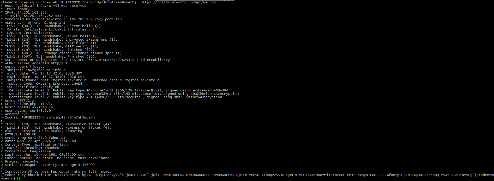\
Почему me.php использует session_start(), а не принимает логин/пароль? 
Пользователь уже залогинился, сессия существует. me.php - это не вход, а получение JWT по уже существующей сессии, 
Какую роль играет кука PHPSESSID в этом запросе? 
Кука - это ключ от сессии. Она связывает текущий браузер с файлом сессии на сервере, где хранятся данные о пользователе. 
## 3. React получает JWT
### 03-console-jwt.png
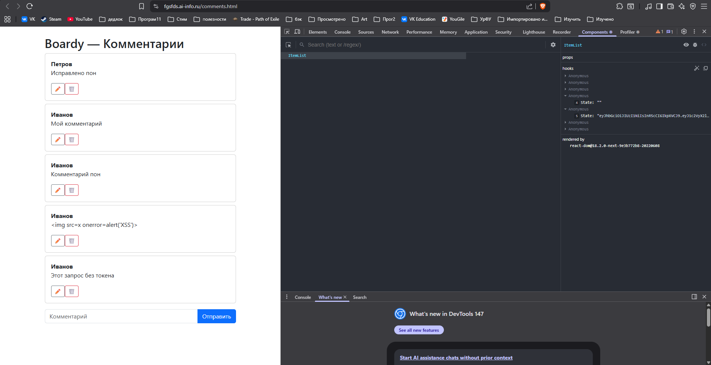
## 4. Регистрация
### 04-bearer-header.png
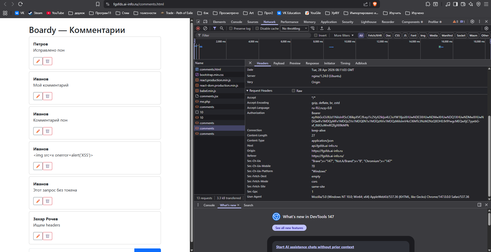
### 05-comment-created.png
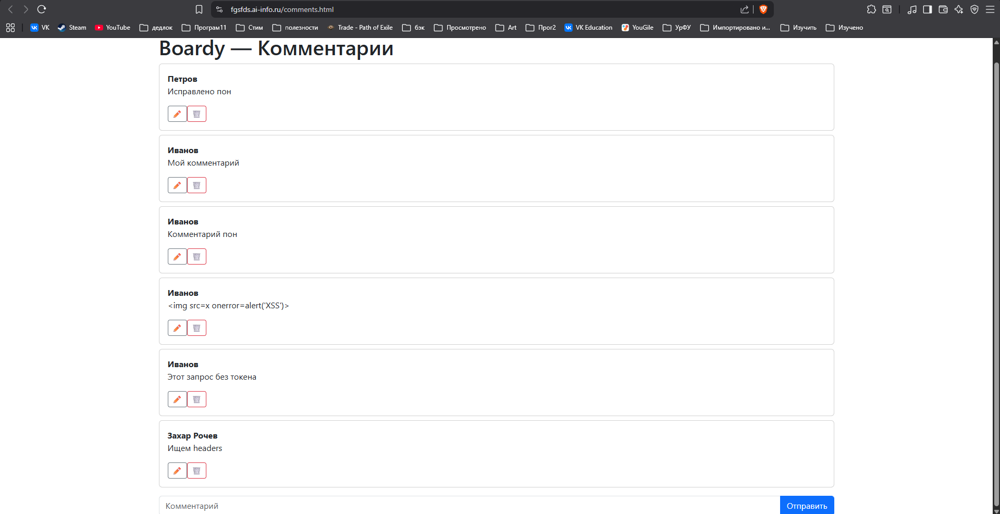
## 5. jwt.io
### 06-jwt-io.png
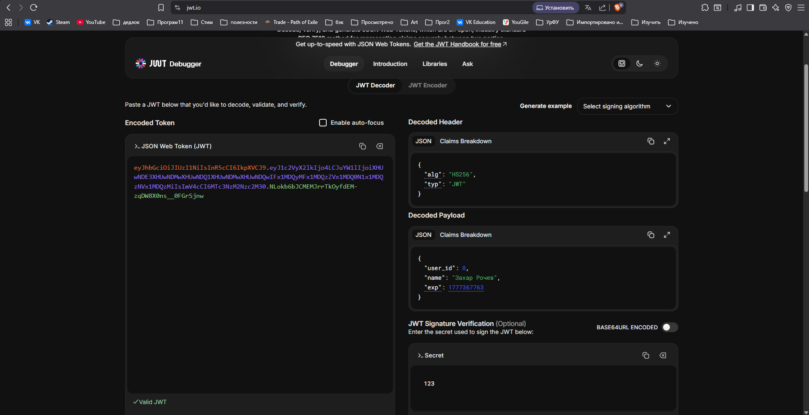
Payload зашифрован или закодирован? 
Закодирован. 
Что увидит злоумышленник, перехвативший токен? 
Если декодировать, то можно будет увидеть user_id, user_name и exp, информацию, которая лежит в JWT.  
Почему это не проблема? 
Срок действия токена быстро истекает. Имя и ID юзера это публичные данные, их и так все видят. По хорошему в JWT не должно быть чувствительной информации. Изменить их нельзя, иначе сломается подпись. 
## 6. Истёкший токен
### 07-expired.png
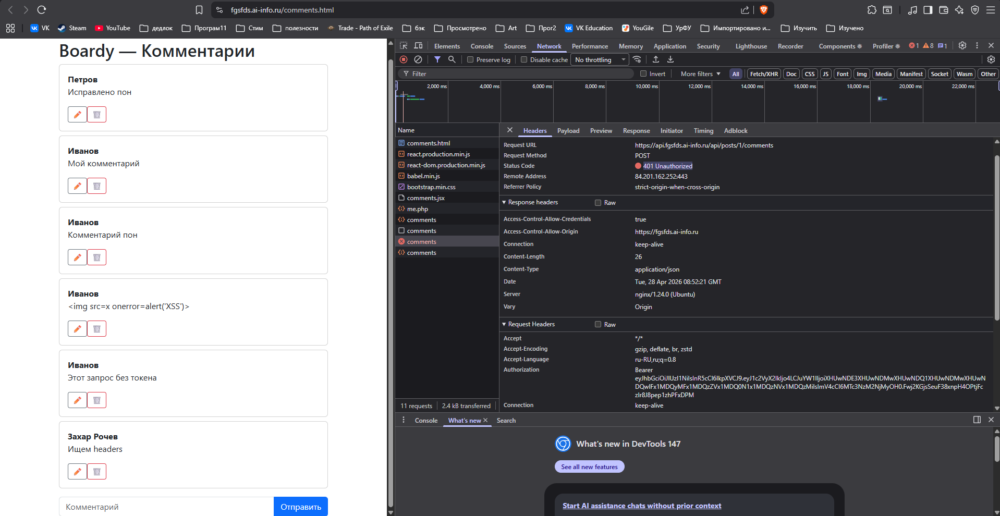
## 7. Невалидный токен
### 08-invalid.png
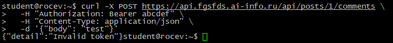

# Часть B. OAuth через GitHub
## 8. OAuth App на GitHub
### 09-github-app.png
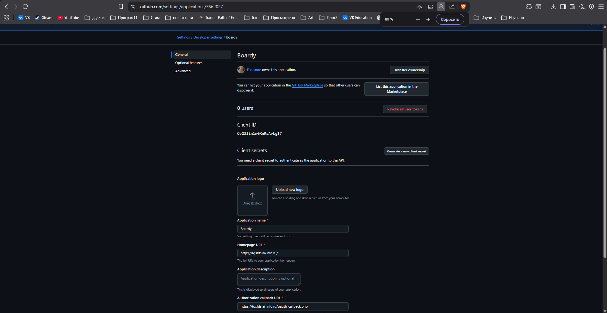
## 9. Столбец github_id
### 10-describe.png
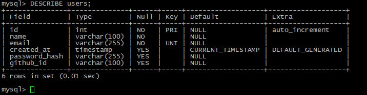
## 10. Кнопка «Войти через GitHub»
### 11-login-button.png
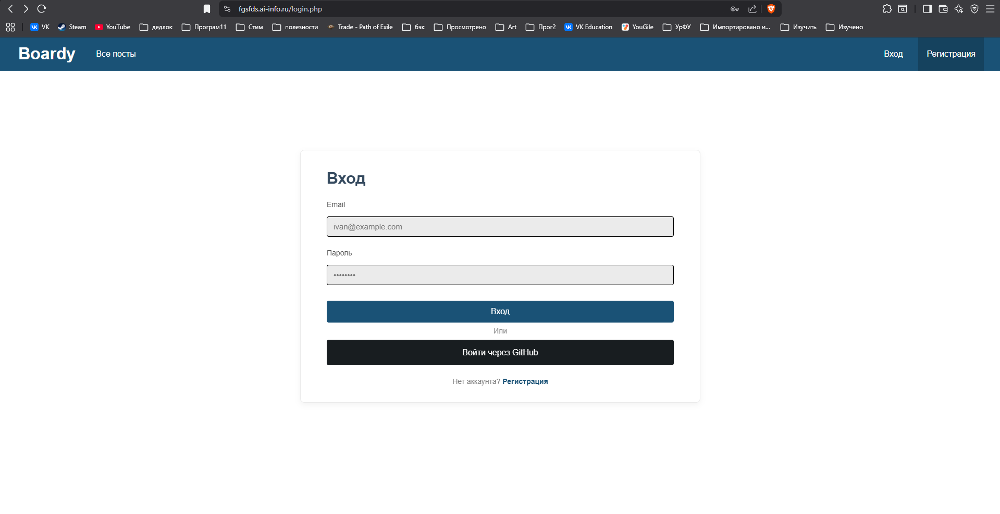\
Добавил на login.php
## 11. OAuth flow
### 12-github-authorize.png
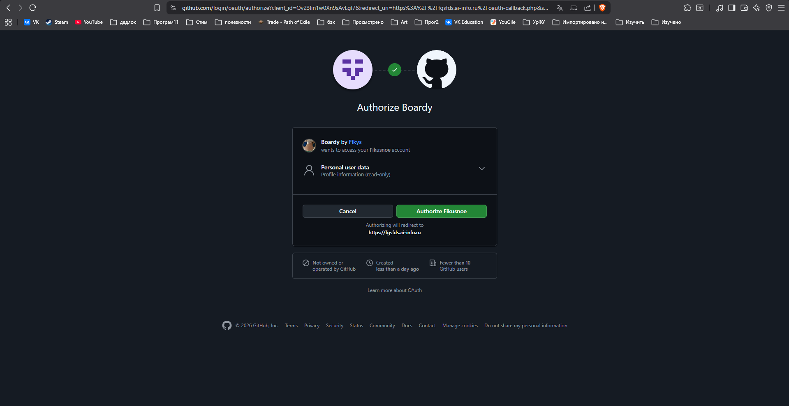
### 13-oauth-logged.png
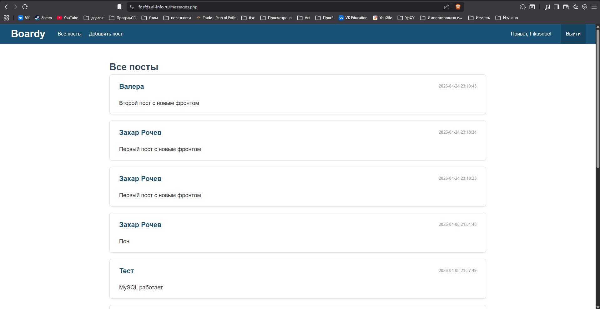
## 12. Файл сессии на сервере
### 14-github-user.png
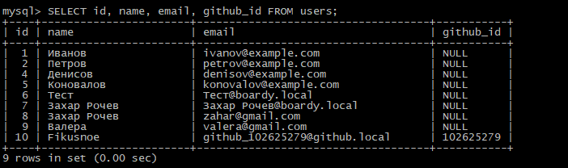\
Почему ищем по github_id, а не по email? 
Потому что входим через github 
## 13. OAuth → JWT → API
### 15-oauth-comment.png
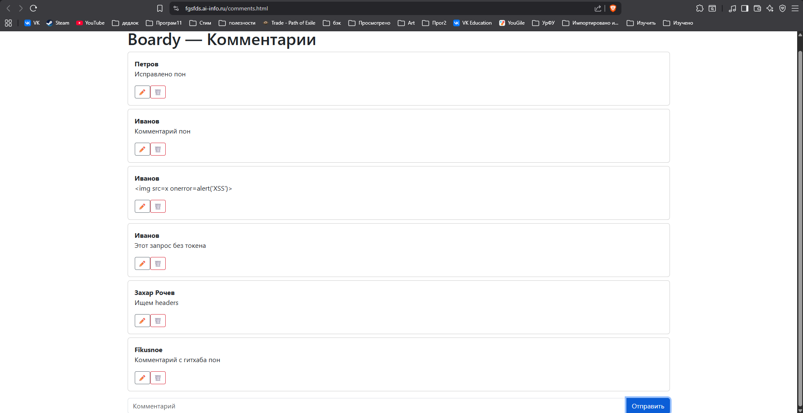
### Полный flow
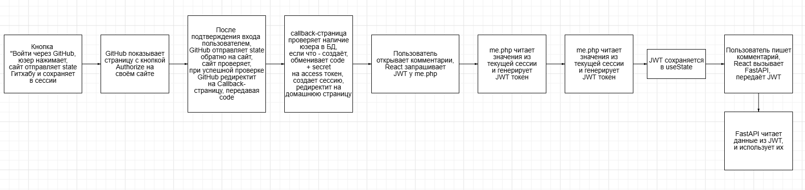
## 14. Параметр state
Что такое state в OAuth? 
state — это случайная строка, которую клиент-сайт генерирует перед редиректом на другой сайт и сохраняет в сессии. При возврате пользователя Второй сайт передаёт тот же state, и клиент-сайт сверяет его с сохранённым в сессии. 
Опишите сценарий CSRF-атаки без state (минимум 5 шагов). 
1) Обычный пользователь входит в аккаунт на сайте, где нет защиты от CSRF, получает куку сессии. 
2) Мошенник формирует свой сайт с кодом, который выполняется при запуске страницы, например POST на Незащищенный сайт. 
3) Мошенник убеждает пользователя зайти на свой сайт с Вредоносным кодом. 
4) Обычный пользователь заходит, код автоматически срабатывает. 
5) Сайт без защиты проверяет куку, она подходит, так как пользователь авторизован 

# Часть C. Анализ
## 15. Три способа входа
### 16-three-users.png
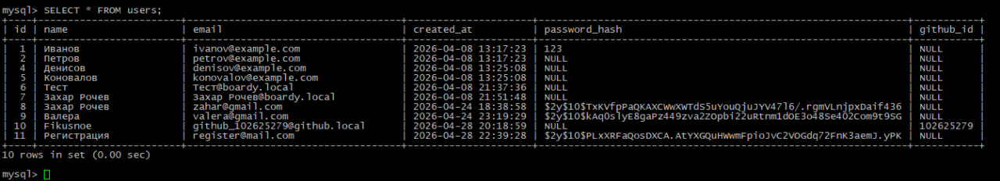
## 16. Сравнение механизмов
### table.png
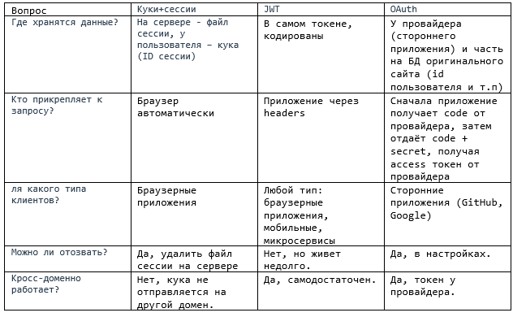
## 17. Баги и пакеты
1) secret_key в коде: сейчас секрет хранится прямо в коде, файлы можно легко залить в гитхаб, где любой может увидеть секрет и воспользоваться им, например, создавая валидные JWT от любого имени. Решает: Passport. 
2) Нет отзыва токенов: Если JWT будет украден, злоумышленник сможет использовать его всё время действия JWT токена (час в boardy). Решает: Passport. 
3) CSRF вручную: если забыть проверить - дыра в безопасности, данные пользователей могут легко утекать с помощью CSRF атаки. Решает: Socialite. 
