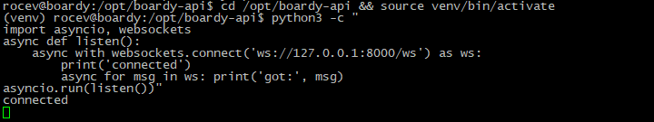
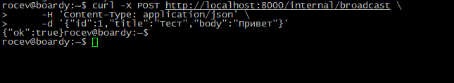
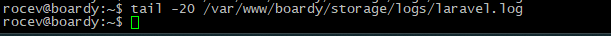
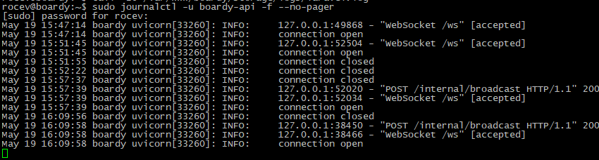
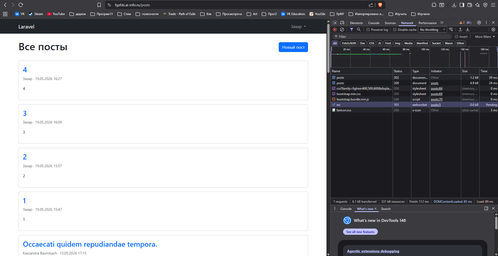
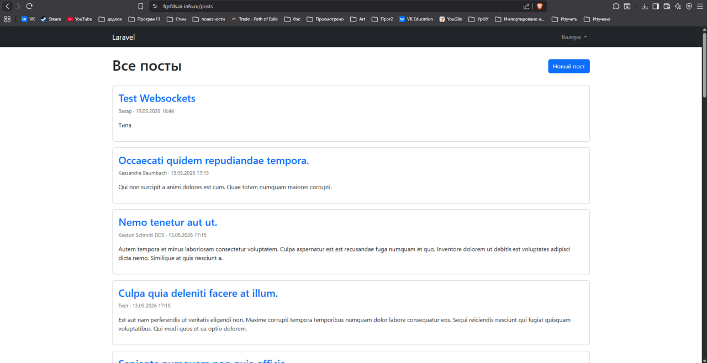
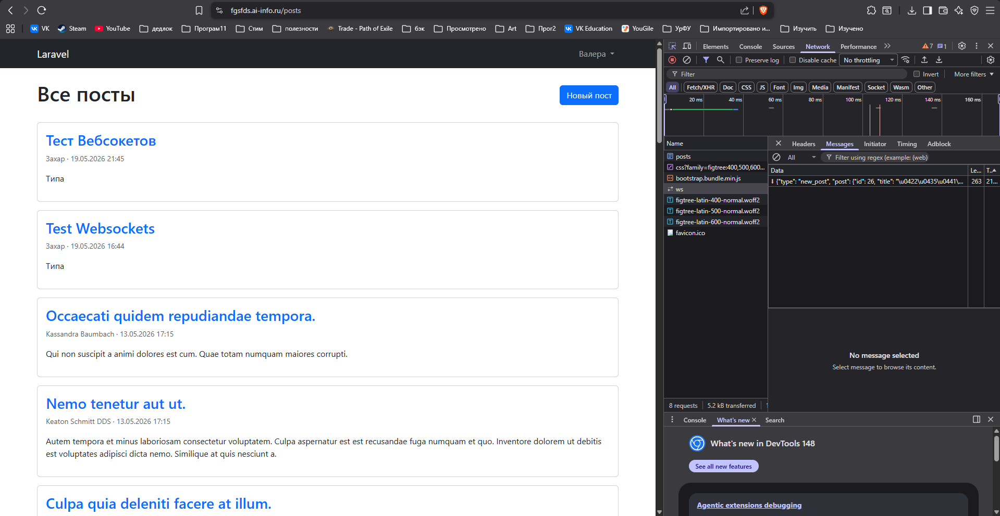
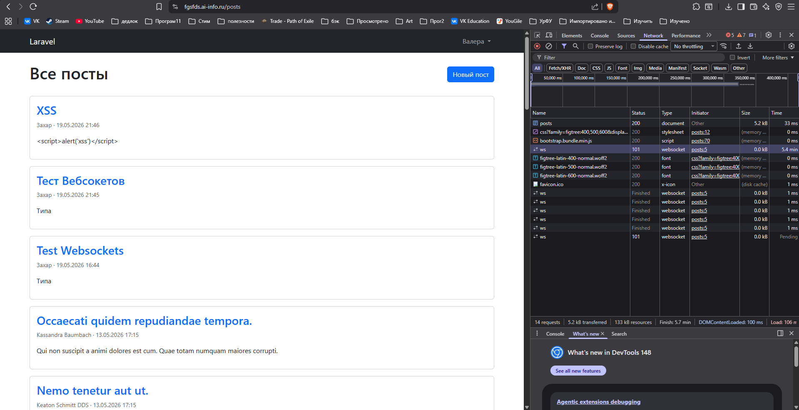
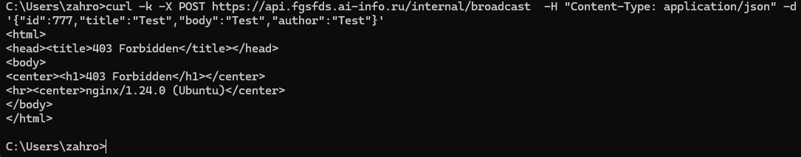

# Практика 12: Laravel: переезд на фреймворк (MVC + Breeze + Socialite)
# Часть A. FastAPI: WebSocket
## 1. ConnectionManager
### 01-ws-connected.png
\
Почему self.active — список в памяти процесса, а не в базе данных? 
Cписок в памяти, потому что WebSocket соединения живут в RAM, так как нужна динамика, а запросы к БД - медленные и тяжеловесные. 
Что произойдёт если Uvicorn перезапустится? 
Все Websocket соединения оборвутся, список очистится 
## 2. /internal/broadcast
### 02-broadcast.png
\
Почему /internal/broadcast не требует JWT-авторизации? 
Потому что этот эндпоинт не предназначен для внешних запросов. Он создан для внутреннего общения между Laravel и FastAPI. 
Какой риск остаётся и как его закрывает Nginx? 
Если кто-то узнает про существование /internal/broadcast/, он сможет отправлять поддельные сообщения в WebSocket, и все пользователи увидят их. 
Nginx просто закрывает эту проблему: в конфигурации запрещены запросы ото всех, кроме localhost (127.0.0.1) 
## 3. Два клиента
### 03-two-clients.png
.png)
.png)\
Что произойдёт если один из клиентов отключился, а broadcast уже начался? 
Отключившийся пользователь не получит сообщение, остальные - получат. 
Где в коде это обрабатывается? 
В ws.py метод broadcast ведёт учёт мёртвых Вебсокетов и удаляет их. 

# Часть B. OAuth через GitHub
## 4. Nginx-конфиг
### 04-laravel-log.png
\
Зачем timeout(2)? 
Таймаут нужен, чтобы пользователь не застрял на странице создания поста. 
Что случится если FastAPI недоступен и timeout не указан? 
Если FastAPI недоступен и нет таймаута, пользователь будет висеть на странице, пока FastAPI не ответит или пока не выдаст ошибку. 
## 5. Проверка callback
### 05-callback.png
\
Почему HTTP-callback называют костылём? 
HTTP-callback — это ручной способ связать два сервиса, который переносит логику доставки на уровень приложения вместо использования брокеров сообщений. 
Опишите проблему этой архитектуры. 
1) Для получения поста нужно дождаться ответа от FastAPI. Если FastAPI тормозит - сообщение придёт с задержкой. 
2) Если есть несколько воркеров Uvicorn и разные ConnectionManager, часть клиентов не получат события 
3) Отсутствие гарантий доставки: при отсутствии доступа к FastAPI или сети, пользователи могут не получить информацию о новом посте. 

# Часть C. WebSocket в Blade
## 6. WebSocket в Blade
### 06-devtools-ws.png
\
Почему на локалке нужно ws://, а на проде wss://? 
ws:// подходит для локалки потому что весь трафик внутри хоста и разработка на ws:// легче и быстрее. Для прода важна безопасность трафика поэтому используем wss:// 
Что произойдёт если использовать wss:// без TLS? 
Браузер требует wss:// для https, без wss:// браузер выкинет ошибку. 
## 7. Два браузера
### 07-two-browsers.png

### 08-devtools-frame.png

## 8. XSS
### 09-show-tables.png
\
Что делает функция escapeHtml()? 
Экранирует символы для безопасного отображения текста. 
Что случится если вставить данные напрямую в innerHTML без экранирования? 
Без экранирования любой может написать скрипт и при загрузке такого скрипта в посте, скрипт выполнится, чем могут воспользоваться хакеры. 

## 9. Переподключение
### 10-reconnect.png
![10-reconnect.png](Screenshots/10-reconnect.png
## 10. Маршруты
### 11-nginx-ws.png
\
Что сломается если убрать proxy_http_version 1.1? 
WebSocket не установится. Nginx по умолчанию использует HTTP/1.0, который не поддерживает протокол Upgrade. Браузер получит ошибку. 
Если убрать proxy_set_header Upgrade? 
FastAPI не поймёт, что нужно переключиться на WebSocket. Заголовок Upgrade говорит серверу сменить протокол с HTTP на WebSocket. Без него соединение останется обычным HTTP и сразу закроется. 
Если убрать proxy_read_timeout? 
Соединение будет обрываться через 60 секунд по умолчанию. WebSocket предназначен для долгоживущих соединений, поэтому нужно увеличивать таймаут 
## 11. Лента постов
### 12-internal-denied.png
\
Почему /internal/broadcast опасен без ограничения доступа? 
Потому что без ограничения доступа любой человек в сети сможет получить доступ к функциям WebSocket на сервере. 
Кто мог бы его вызвать? 
Все, кто знают об этой уязвимости. 
