# Практика 14: Финальная микросервисная архитектура
# Часть A. Passport как OAuth 2.1 сервер
## 1. Установка и SPA-клиент
### 01-passport-install.png
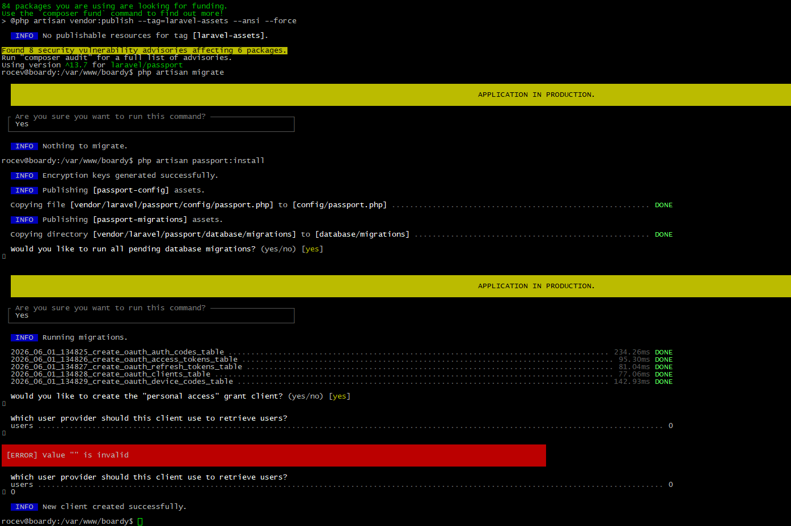
### 02-spa-client.png
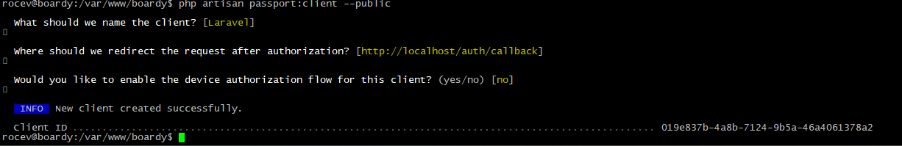\
Почему публичный клиент без secret? 
Любой пользователь может посмотреть код публичного клиента и найти там client secret, это небезопасно. 
Чем PKCE заменяет client_secret и от какой атаки защищает? 
PKCE создаёт одноразовый секрет прямо в браузере на момент авторизации. Защищает от перехвата кода авторизации. 
## 2. TTL и refresh
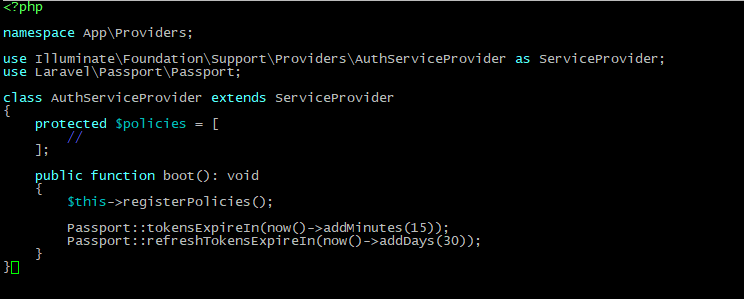\
почему access короткий, а refresh длинный? 
access короткий, потому что он часто используется, при утечке токена он быстро протухает, refresh токен нужен чтобы обновить access токен, он используется реже и хранится в более безопасной среде HttpOnly Cookie. 
Что произойдёт если access будет 24 часа? 
Человек, укравший access сможет делать запросы от лица пользователя всё время действия токена, 24 часа - очень долго 
## 3. Проверка выдачи через curl
### 04-pkce-curl.png
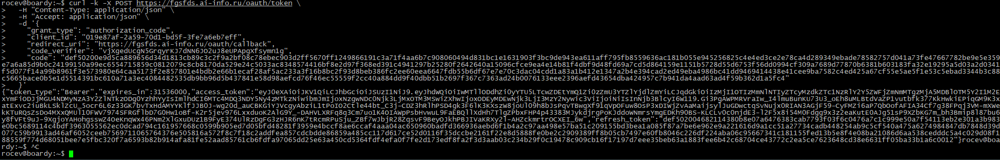\
Какие шаги OAuth flow прошёл этот curl-запрос? 
1) Фронтенд создаёт code_verifier и code_challenge 
2) На /oauth/authorize передаётся code_challenge 
3) Пользователь входит в аккаунт 
4) Сервер редиректит на страницу с code 
5) На /oauth/token передаётся code и code_verifier 
6) Сервер проверяет эти строки и отдаёт токен, в случае совпадения. 

# Часть Б. Создание boardy_api
## 4. Создание boardy_api
### 05-databases.png
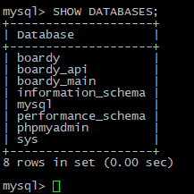
### 06-comments-schema.png
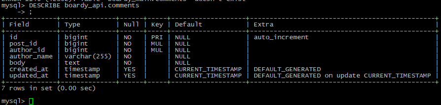\
почему access короткий, а refresh длинный? 
access короткий, потому что он часто используется, при утечке токена он быстро протухает, refresh токен нужен чтобы обновить access токен, он используется реже и хранится в более безопасной среде HttpOnly Cookie.  
Что произойдёт если access будет 24 часа? 
Человек, укравший access сможет делать запросы от лица пользователя всё время действия токена, 24 часа - очень долго 
## 5. FastAPI подключён к новой БД
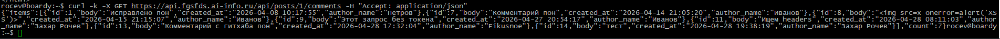

# Часть В. FastAPI: RS256 + полный CRUD
## 6. RS256 проверка
### 08-rs256-success.png
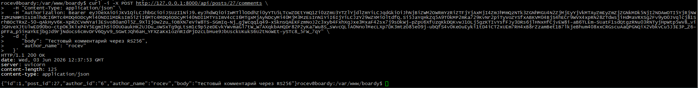
### 09-rs256-fail.png
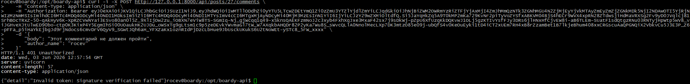\
Почему RS256 безопаснее HS256 для распределённых систем? 
HS256  - это симметричный алгоритм. Для создания токена и для его проверки используется один и тот же секретный ключ. 
RS256 - это асимметричный алгоритм. Используется пара ключей: приватный (для подписи) и публичный (для проверки). 
Подпись токенов у RS256 будет на одном сервисе, где хранится приватный ключ, у остальных сервисов - публичные ключи, в отличии от HS256, где у всех сервисов приватный ключ и при утечке нужно будет менять его на всех сервисах. 
## 7. Полный CRUD с author_name
### 10-crud-all.png
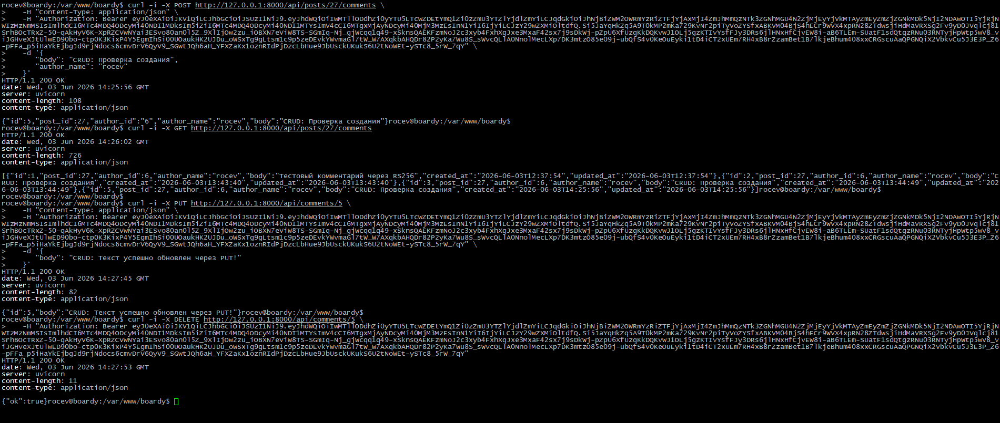\
Почему author_name передаётся в payload запроса, а не извлекается из токена? 
Потому что токен - данные, которые индентифицируют пользователя в системе. С помощью него система удостоверяется в правах доступа пользователя. 
Payload - данные, которые применяются в какой-то операции. Имя в сервисе можно поменять, а подделать токен - нет.  
Пользователь отправляет на сервер запрос, подтверждает свою личность за счёт токена, передаёт остальные данные о запросе в Payload. 
Что было бы если зашить в JWT custom claim? 
Помимо того, что токен сам по себе довольно большой, еще он создается на какой-то промежуток времени. Если пользователь поменяет имя, а токен не обновится, то имя пользователя в постах будет старое, пока не обновится токен. 
## 8. Owner check
### 11-owner-check.png
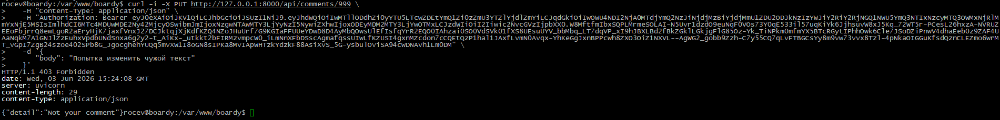\
Где в коде проверяется владелец? 
Владелец проверяется в файле /opt/boardy-api/routers/comments.py внутри эндпоинтов @router.putи @router.delete. Проверяется ID авторов. 
Что произойдёт если убрать эту проверку? 
Если убрать проверку на права редактирования, то любой авторизированный пользователь сможет сделать что угодно с любым комментарием. 
## 9. CORS
### 12-cors-config.png
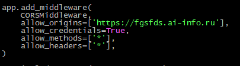\
Почему allow_origins=['*'] + credentials=true браузер блокирует? 
Чтобы работал механизм безопасности от CSRF атак. 
Что произошло бы с куками если бы пропустил? 
Любой сайт смог бы получить куки пользователя с любого другого сайта. 

# Часть Г. React PKCE flow
## 10. PKCE утилиты
### 13-pkce-utils.png
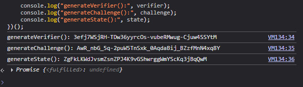\
Почему code_challenge передаётся в /authorize, а code_verifier — в /token? 
/authorize - небезопасная зона, данные оттуда могут перехватить, поэтому отправляется code_challenge - хэш code_verifier. Даже если кто-то перехватит  code_challenge, получить verifier обратно он не сможет, потому что хеширование - односторонняя функция. 
Что если перепутать? 
Во-первых система запутается, потому что challenge это Хеш verifier, расшифровка verifier не даст challenge, во-вторых это нарушает идею PKCE. 
## 11. Login flow
### 14-login-redirect.png
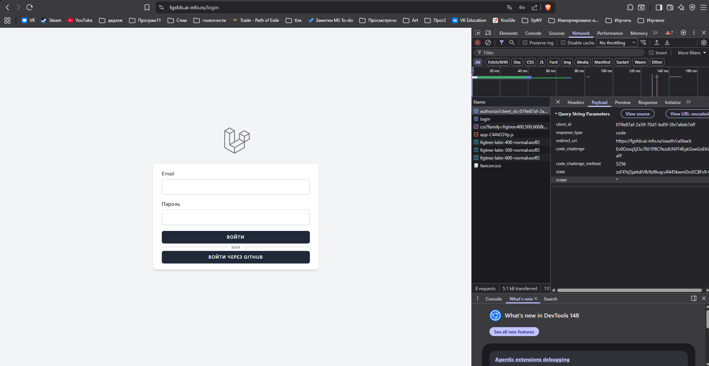
### 15-login-callback.png
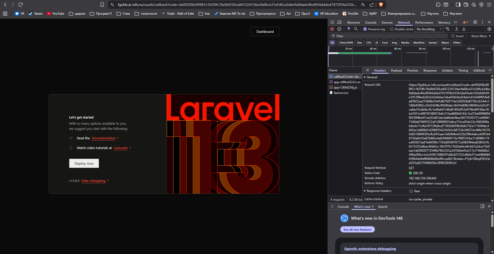
## 12. Обмен code на токены
### 16-token-exchange.png
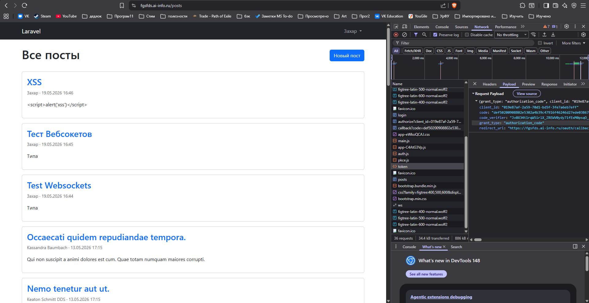\
Что произойдёт если убрать проверку state? 
Сервис не будет проверять достоверность ссылки, откуда вернулся пользователь (из callback, например). Так, пользователю могут подсунуть вредоносную ссылку, из-за которой он может зайти не в свой, а в чужой аккаунт. 
Какая атака возможна? 
CSRF 
## 13. Refresh token в HttpOnly cookie
### 17-refresh-cookie.png
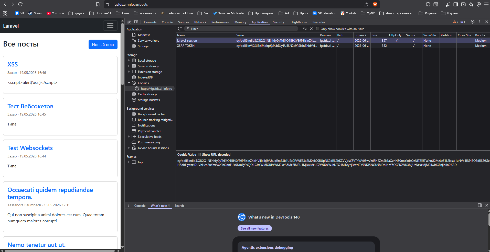\
Что случится если refresh положить в localStorage и сайт получит XSS? 
В таком случае пользователь, похитивший refresh, получит полный контроль над украденным аккаунтом на полное время ддлительности refresh (может быть очень долго) 
## 14. Silent refresh
### 18-silent-refresh.png
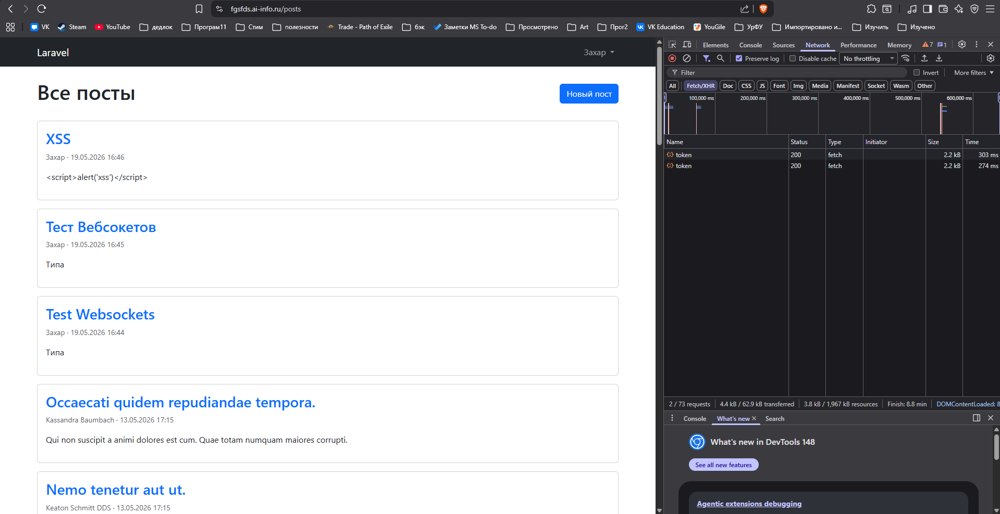

# Часть Д. Redis Pub/Sub
## 15. Redis установлен
### 19-redis-ping.png
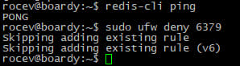
## 16. Laravel publish new_post
### 20-laravel-publish.png
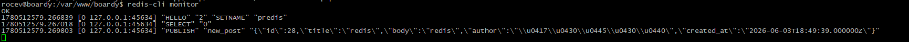\
Чем Redis::publish архитектурно лучше Http::post() к FastAPI? 
Redis создаёт каналы Sub и Pub. Сервисы остаются независимы друг от друга, они никак друг с другом не взаимодействуют, кроме этих каналов. Кроме того, чтобы сервисы получали сообщения от Pub, сервисам достаточно  подписаться на этот канал, а не создавать от главного сервиса для нескольких других сервисов несколько запросов. 
## 17. FastAPI subscriber на new_post
### 21-subscriber-running.png
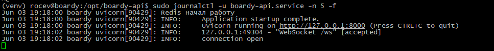
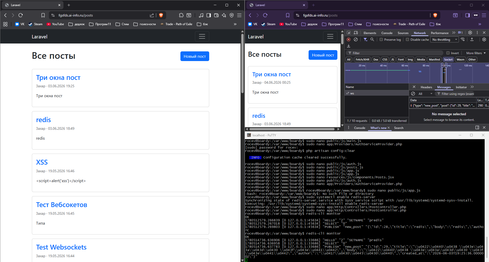
## 18. User observer и user.renamed
### 23-user-renamed.png
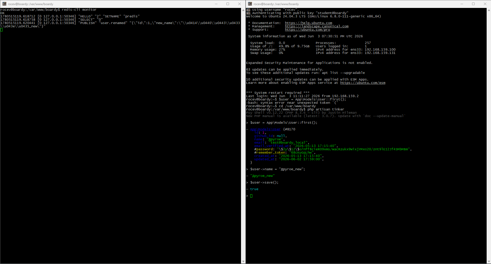
Почему UserObserver вызывается автоматически?  
После обновления User, идёт обращение к AppServiceProvider, в нём указан класс UserObserver, у которого есть метод updated.  
Где это магия Laravel? 
Из бд диспетчер событий смотрит в  AppServiceProvider и потом работа с UserObserver.php 
## 19. Денормализация имени
### 24-denorm-before.png
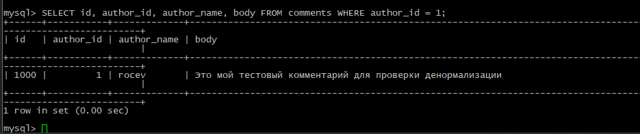
### 24-denorm-before.png
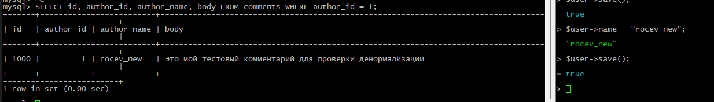

# Часть Е. Финальные проверки
## 20. Два браузера: посты в реалтайме
### 26-two-browsers-post.png
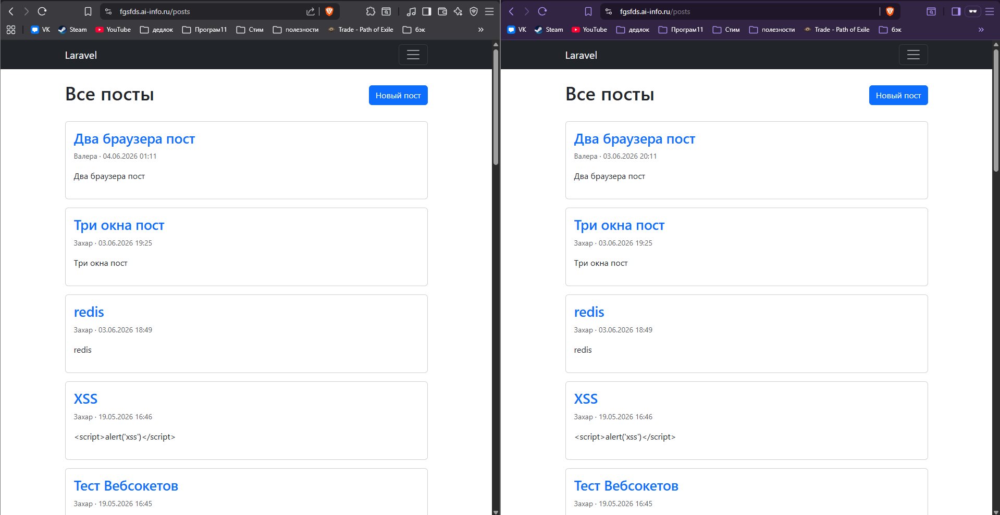
## 21. Два браузера: комментарии в реалтайме
### 27-two-browsers-comment.png
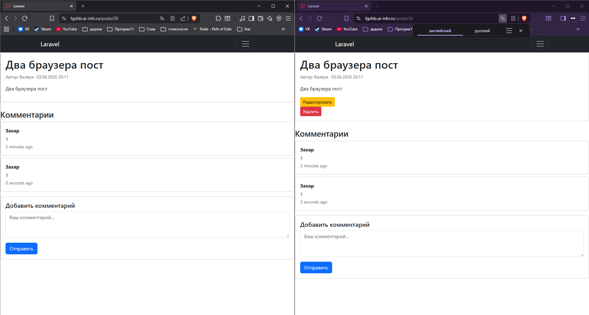
## 22. Никаких прямых HTTP-вызовов
### 28-no-http-callback.png
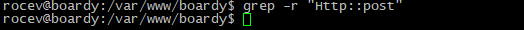
### 29-nginx-no-internal.png
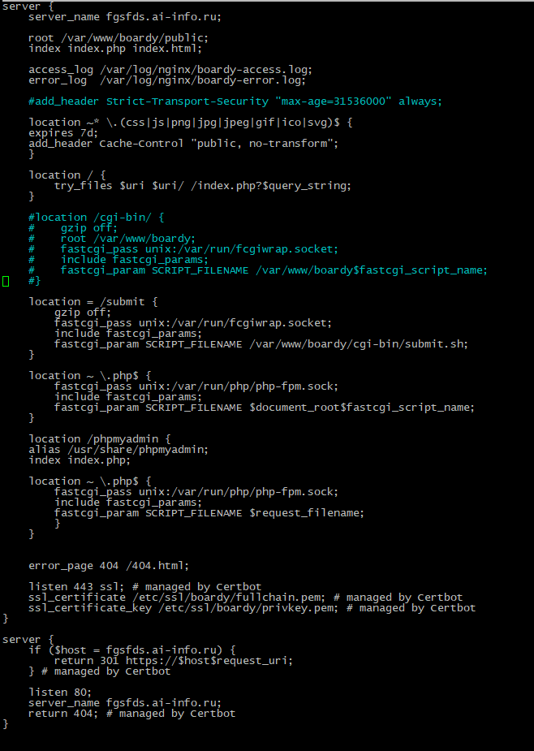

