# Практика 14: Docker и Docker Compose
# Часть A. Dockerfile для Laravel
## 1. PHP-FPM с расширениями
### 01-laravel-build.png
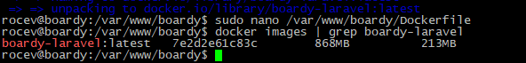\
Зачем PHP-FPM в Docker, а не Apache+PHP? 
PHP-FPM позволяет разделить веб-сервер (Nginx) и обработчик PHP на независимые контейнеры, что соответствует принципу микросервисной архитектуры.  
Какое архитектурное преимущество? 
Это дает лучшую производительность при обработке статики, гибкое масштабирование и возможность обновлять компоненты по отдельности. 
## 2. Кеширование composer-зависимостей
### 02-composer-layer.png
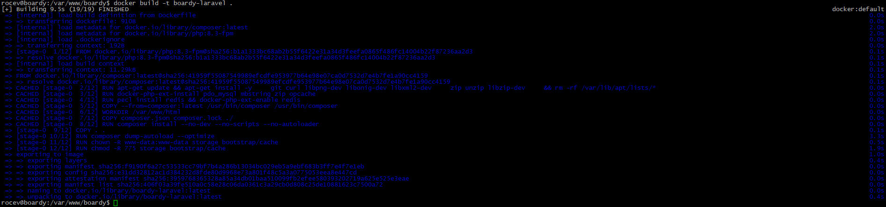\
Что произойдёт если COPY всего проекта сделать ДО composer install? 
Если composer.json не менялся - composer install не выполнится при следующей сборке. Если сделать COPY всего проекта до composer install, то при любом изменении даже одной строчки в коде Docker будет заново пересобирать этот слой. 
Механизм кеширования слоёв Docker: 
Docker строит образ как стопку слоев. Каждый слой создается инструкцией в Dockerfile (FROM, RUN, COPY). 
1) Кэш по контенту: Docker вычисляет хеш-сумму (checksum) для каждого слоя. Если инструкция и файлы, которые она использует, не изменились, Docker берет готовый слой из кэша. 
2) Как только один слой меняется, все последующие слои пересобираются заново, так как их базовый слой изменился. 
## 3. .dockerignore
### 03-dockerignore.png
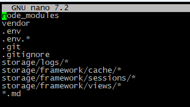\
Что произойдёт если не исключить .env из образа? 
Если не исключить .env из образа, все секреты (пароли от БД, API-ключи, приватные ключи шифрования) окажутся «зашиты» внутрь Docker-образа. 
Какая угроза безопасности? 
Любой человек может посмотреть и скачать .env, получить полный доступ к внутрянке приложения. 

# Часть Б. Dockerfile для FastAPI
## 4. requirements.txt
### 04-requirements.png
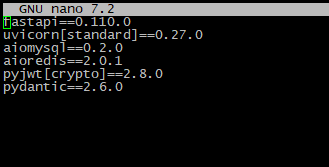\
Почему версии фиксируем, а не пишем 'latest'? 
Фиксация версий гарантирует воспроизводимость: у каждого разработчика будет одни и те же версии библиотек, что даст одинаковые условия для разработки. 
Что произойдёт через год без фиксации? 
Без фиксации через год библиотеки могут серьёзно изменится, что может привести к поломке работоспособности кода. 
## 5. Сборка образа
### 05-fastapi-build.png
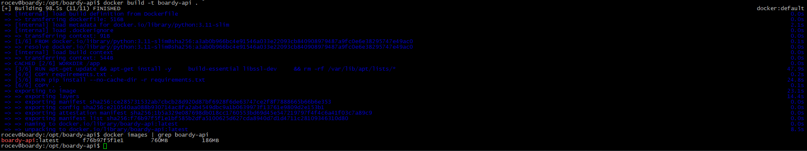
## 6. CMD с правильным host
### 06-uvicorn-cmd.png
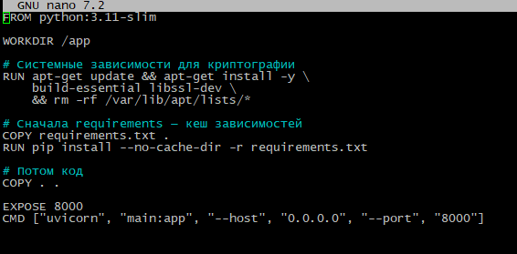\
Почему --host 0.0.0.0, а не 127.0.0.1? 
127.0.0.1 - это локалхост, порт внутри самого же контейнера. Он означает "принимать соединения только изнутри этого же контейнера". 
0.0.0.0 означает: «слушать на всех сетевых интерфейсах контейнера». Это позволяет другим контейнерам в той же Docker-сети обращаться к твоему приложению по его внутреннему IP-адресу или имени сервиса. 
Что сломается с 127.0.0.1? 
Если Nginx захочет обратиться к FastAPI, он будет стучаться в 127.0.0.1, то есть в свой же контейнер. В итоге получится 502 ошибка. 

# Часть В. Конфиг Nginx
## 7. docker/nginx/default.conf
### 07-nginx-conf.png
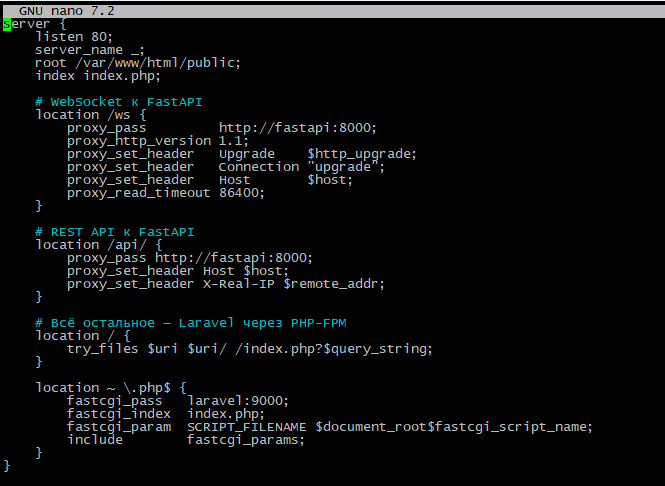\
почему laravel:9000, а не 127.0.0.1:9000? 
127.0.0.1:9000 не сработает, потому что в мире Docker каждый контейнер - это изолированная среда со своим собственным localhost. Для контейнера Nginx адрес 127.0.0.1 указывает на него самого, а не на соседний контейнер с Laravel. 
Как Docker резолвит имена контейнеров? 
Это работает благодаря встроенному DNS-серверу, который автоматически запускается в каждой пользовательской сети: 
Service Discovery: описанные сервисы в docker-compose.yml, Docker регистрирует во внутреннем DNS. 
Обращение по имени: Когда Nginx внутри своего контейнера видит запрос к http://laravel:9000, он отправляет DNS-запрос встроенному серверу Docker'а: «Какой IP у контейнера с именем laravel?». 
Маршрутизация: Docker возвращает внутренний IP-адрес контейнера Laravel (например, 172.18.0.3), и Nginx успешно передает ему данные через FastCGI. 
## 8. WebSocket location
### 08-ws-config.png
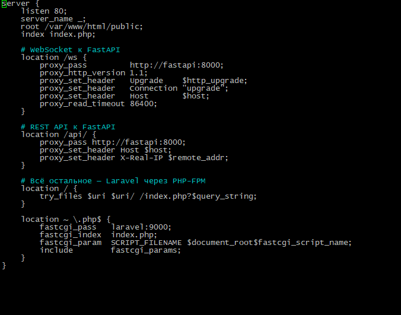\
Где в коде проверяется владелец? 
Владелец проверяется в файле /opt/boardy-api/routers/comments.py внутри эндпоинтов @router.putи @router.delete. Проверяется ID авторов. 
Что произойдёт если убрать эту проверку? 
Если убрать проверку на права редактирования, то любой авторизированный пользователь сможет сделать что угодно с любым комментарием. 

# Часть Г. docker-compose.yml
## 9. Пять сервисов
### 09-compose-services.png
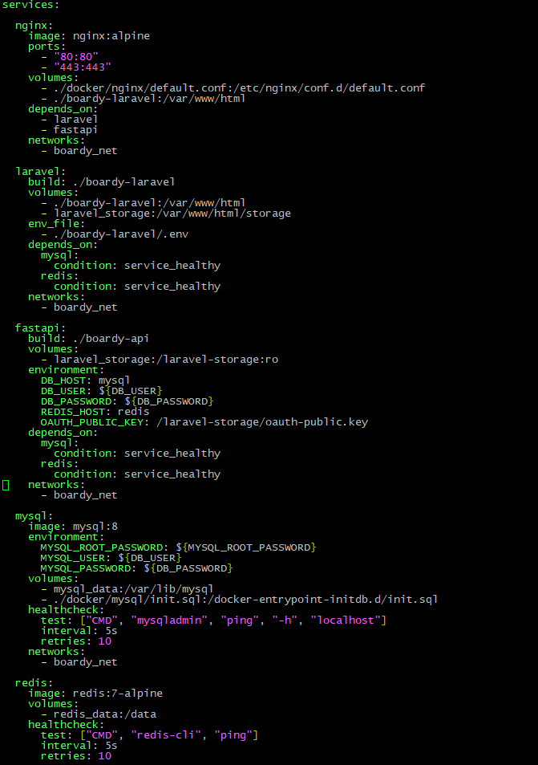\
## 10. Volumes
### 10-volumes.png
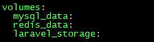\
Что произойдёт с данными MySQL если убрать mysql_data volume и сделать docker compose down?  
Если убрать mysql_data volume, то при  docker compose down данные удаляться, а при новом up MySQL запустится полностью пустым, с чистого листа. 
Volume (mysql_data) нужен для того, чтобы данные жили вне жизненного цикла контейнера. 
Чем именованный volume отличается от bind-mount? 
Именованный volume управляется самим Docker и хранит данные в системной директории. Bind mount напрямую связывает конкретную папку на хосте с контейнером, что удобно для разработки кода, но менее производительно для хранения данных. 
## 11. Healthcheck для MySQL и Redis
### 11-healthcheck.png
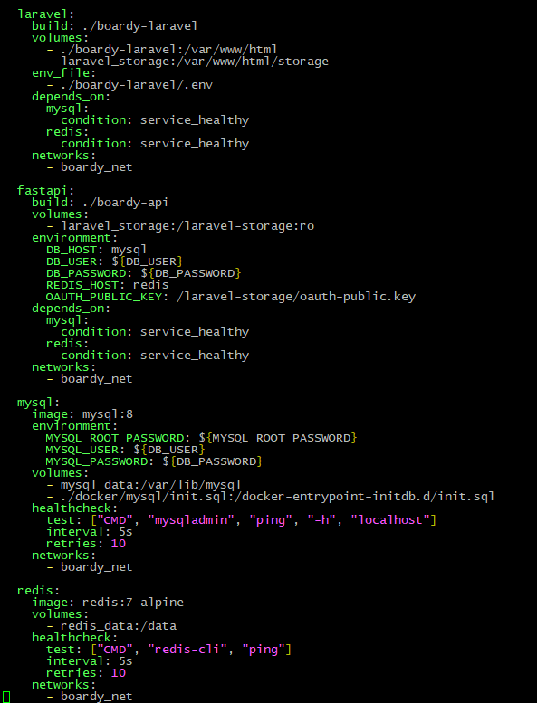\
Почему depends_on без healthcheck недостаточно? 
depends_on гарантирует лишь порядок запуска контейнеров, но не их готовность к работе. 
Какая race condition возникает? 
MySQL может стартовать позже Laravel, но внутри себя он будет еще долго инициализировать таблицы и файлы, поэтому при попытке подключения Laravel получит ошибку подключения. 
## 12. init.sql для двух БД
### 12-init-sql.png
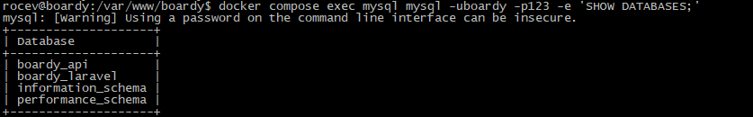
### 12-init-sql.png
\
Почему init.sql выполняется только при первом запуске? 
Образ MySQL настроен так, что он запускает скрипты, только если папка с данными /var/lib/mysql - пуста. 
Что произойдёт если изменить файл после первого запуска? 
Обновлённые файлы будут проигнорированы после первого запуска. 
## 13. Два .env файла
### 14-env-compose.png
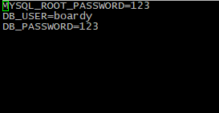
### 15-env-laravel.png
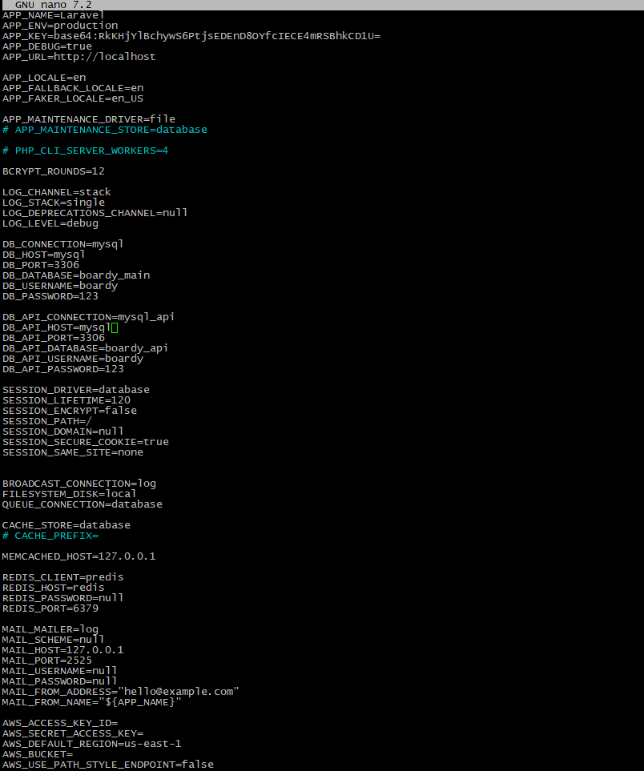\
Зачем два разных .env? 
Это два разных файла для двух разных программ. Корневой нужен для Docker Compose, чтобы читать переменные и подставлять их в docker-compose.yml. 
У Laravel .env используется для своих переменных, например путь и пароль к БД. 
Почему DB_HOST=mysql, а не 127.0.0.1? 
127.0.0.1 - локалхост, а в Докере каждый сервис - отдельное приложение. Если указать 127.0.0.1, то запросы будут идти не в другой контейнер, а внутри одного. 

# Часть Д. Запуск и проверка
## 14. docker compose up
### 16-compose-up.png
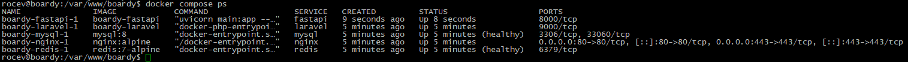
## 15. Миграции в контейнере
### 17-migrate.png
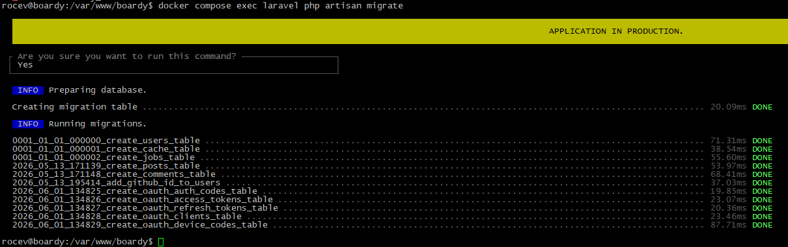
### 18-passport-install.png
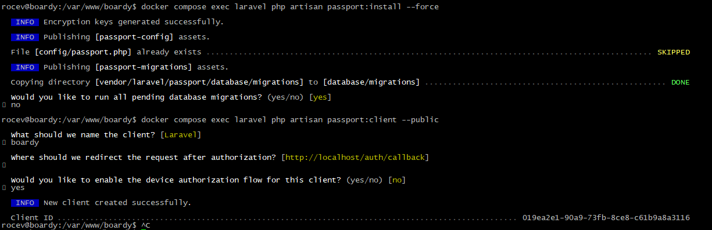\
Чем docker compose exec отличается от docker compose run? 
compose exec выполняет команду в уже запущенном контейнере, когда как docker compose run запускает отдельный контейнер и удаляет его после завершения команды. 
## 16. Приложение работает
### 19-app-running.png
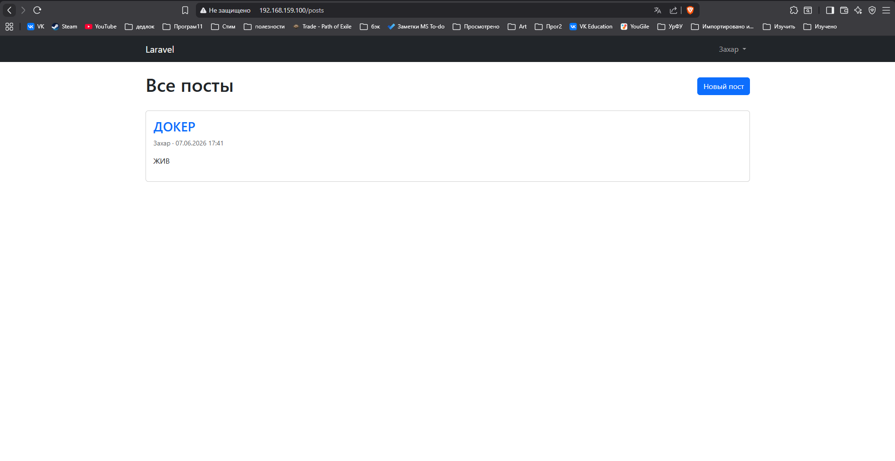\
### 20-comment-works.png
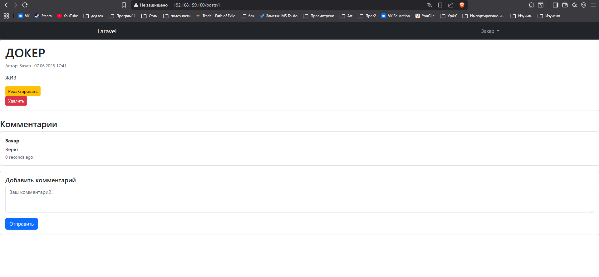\
## 17. Реалтайм работает
### 21-realtime-posts.png
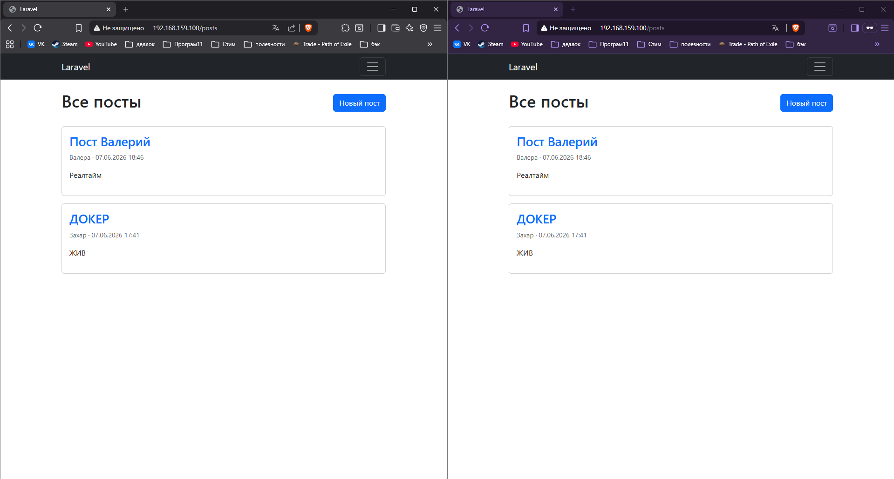
### 22-realtime-comments.png
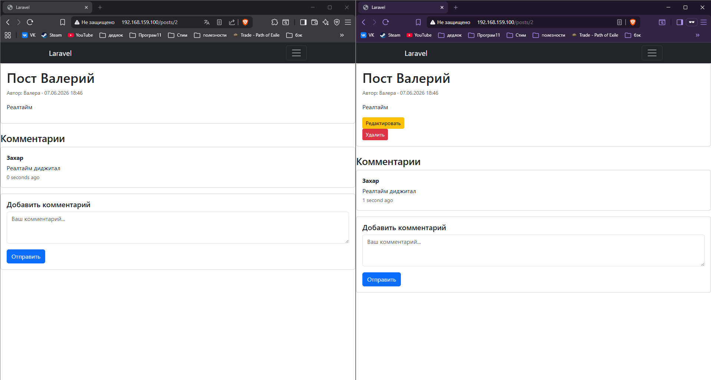
## 18. Данные переживают перезапуск
### 23-persist.png
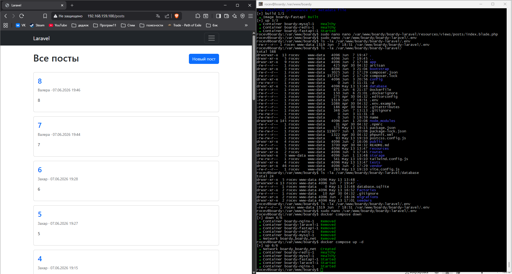\
Что произойдёт с данными при docker compose down -v? 
Без флага - останавливаются и удаляются контейнеры и образы, но сохраняются данные. При флаге -v так же удаляются абсолютно все данные. 
В чём опасность флага -v? 
Риск потерять все данные, невозможность восстановления, потери состояний сервисов. 
## 19. Централизованные логи
### 24-logs.png
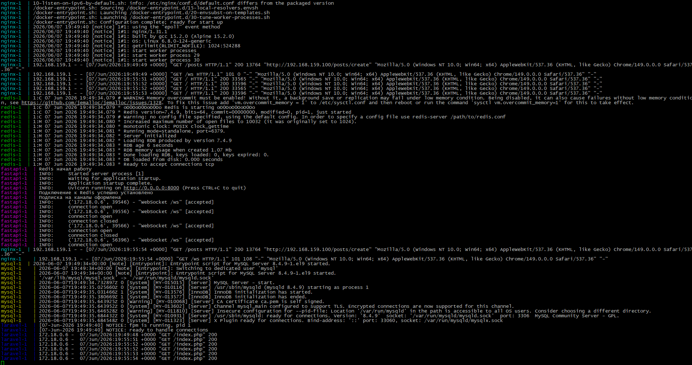\
Какие плюсы централизованных логов Docker по сравнению с tail -f /var/log/* на хосте? 
1) Логи сразу отсортированы по времени и синхронизированны, можно сразу посмотреть как действия на одном сервисе отразились на другом. 
2) Логи в докере не привязаны к самому контейнеру, он может быть удалён, но логи останутся. 
3) Доступ к логам докер можно выдать без прав root или sudo 
## 20. Чистая машина
### 25-fresh-install.png
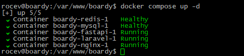
Какая команда нужна на новой машине от клона репозитория до рабочего приложения? 
1) Клонирование: 
git clone "ссылка на репозиторий" 
Создаем файл переменных для Docker Compose: 
cp .env.example .env 
Создаем файл переменных для Laravel: 
cp boardy-laravel/.env.example boardy-laravel/.env 

2) Сборка и запуск: 
docker compose build 
docker compose up -d 

3) Инициализация приложения: 
PHP: 
docker compose exec laravel composer install --no-interaction 
docker compose exec laravel php artisan key:generate 
Миграции для БД: 
docker compose exec laravel php artisan migrate --force 
Настройка OAuth: 
docker compose exec laravel php artisan passport:install --no-interaction 
docker compose exec laravel php artisan passport:client --public \ 
    --name="Boardy SPA" \ 
    --redirect_uri="http://localhost/oauth/callback" 
    
4) Проверка: 
docker compose ps 
