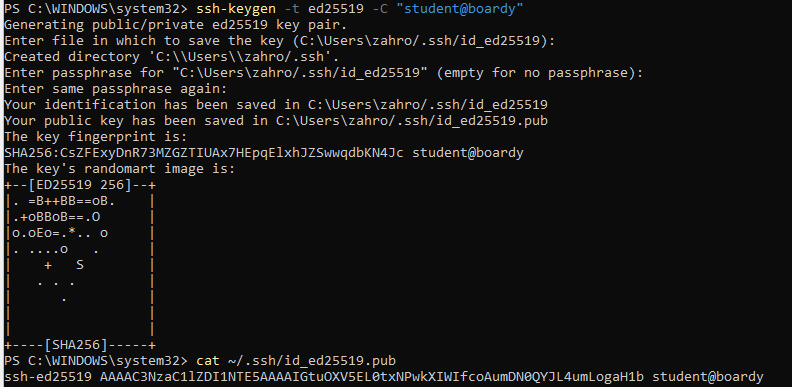
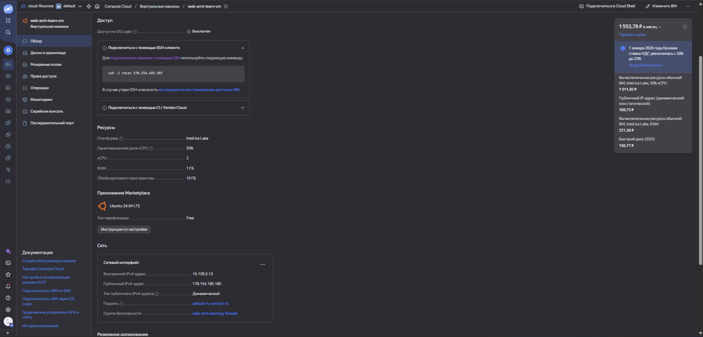
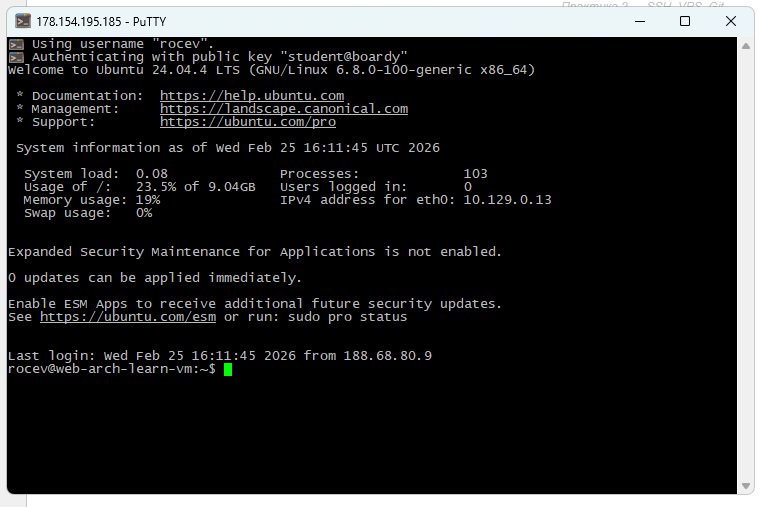
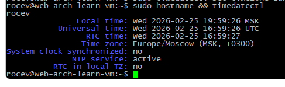
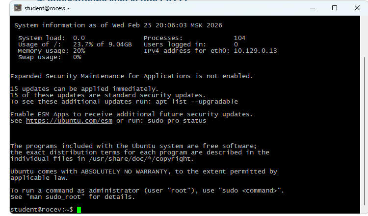
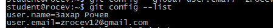
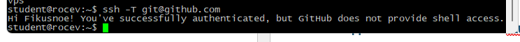
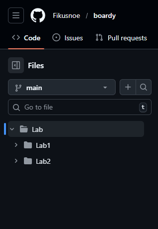
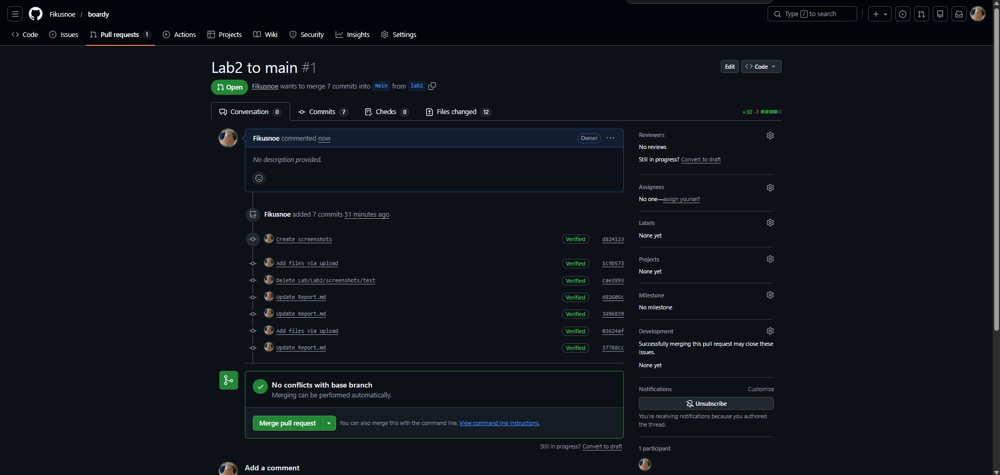

# Практика 2
## 1. SSH-ключ

## 2. VPS и файрвол

.png)
.png)
## 3. Подключение через PuTTY

## 4. Настройка сервера

## 5. Пользователь student

## 6. Git и SSH-ключ → GitHub

## 7. Репозиторий и структура

## 8. Ветка и Pull Request

