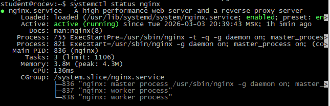
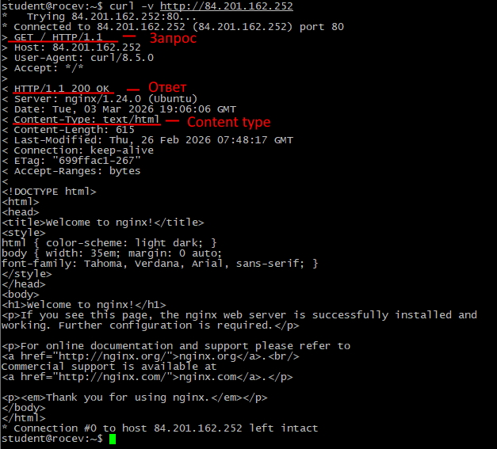
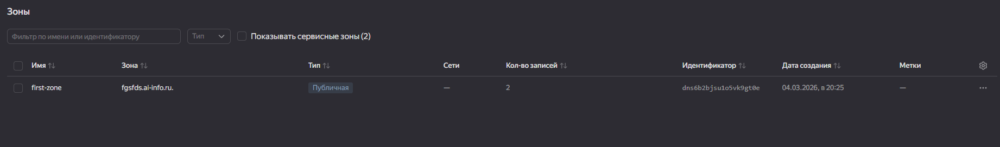
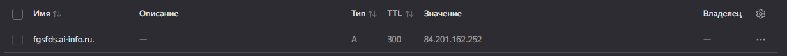
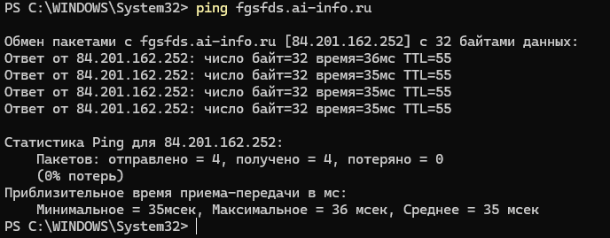
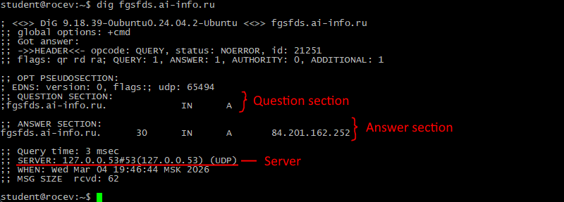
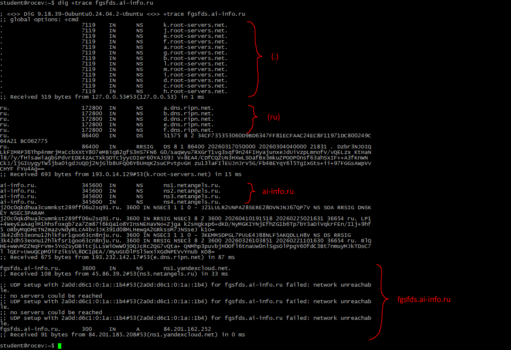
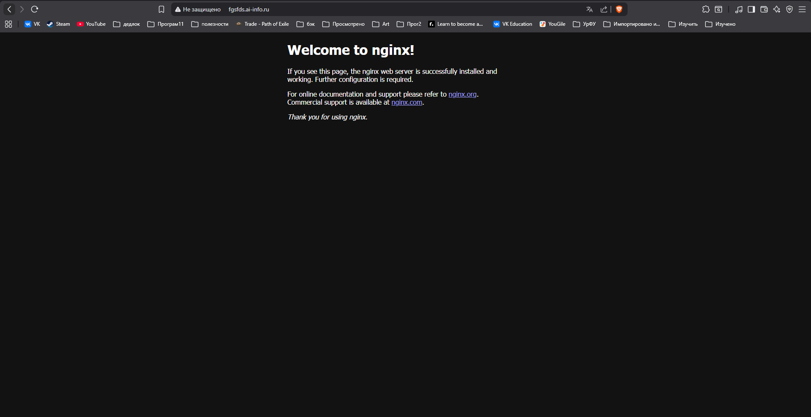

# Практика 3
# Часть A. Nginx
## 1. Установка Nginx
### 01-nginx-status

## 2. Страница по IP
### 02-browser-ip

## 3. curl
### 03-curl

## 4. Директория и права
### 04-permissions

## 5. Конфигурация Nginx

listen 80 default_server;
listen [::]:80 default_server;

root /var/www/html;

server_name _;

index index.html index.htm index.nginx-debian.html;

# Часть B. DNS
## 6. DNS-зона
### 05-dns-zone

## 7. A-запись
### 06-a-record

## 8. ping
### 07-ping

## 9. dig
### 08-dig

10. dig +trace
### 09-dig-trace

##11. Сайт по домену
### 10-browser-domain

