# Практика 3
# Часть A. Виртуальный хост основного сайта
## 1. Директория проекта
### 01-directory
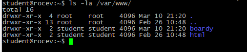
## 2. Конфиг виртуального хоста
### 02-browser-ip
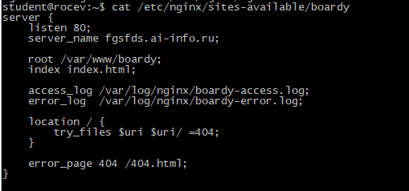\
server_name - название домена. 
root - папка откуда берутся файлы. 
access_log - лог для подключения. 
error_log - лог для ошибок. 
try_files — ищет файл, не нашёл - 404 ошибка. 
error_page - страница ошибки 404. 

# Часть B. Страницы проекта
## 3. Лендинг
### 03-landing
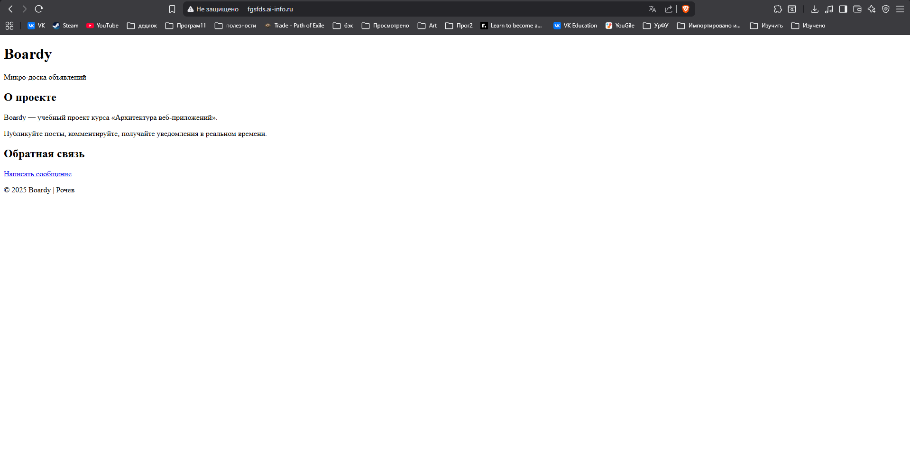
## 4. Форма обратной связи
### 04-permissions
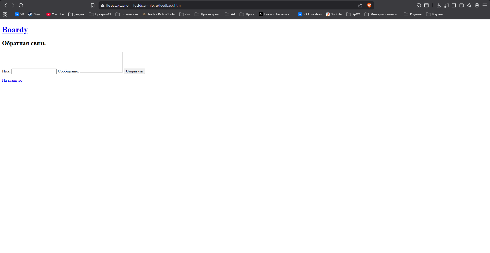
## 5. Стили и 404
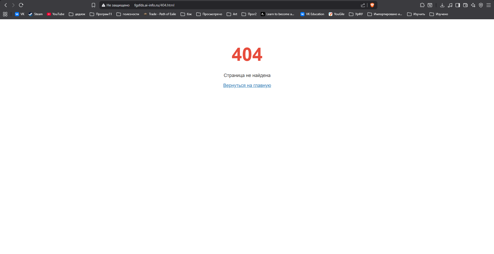

# Часть C. Второй виртуальный хост — API
## 6. DNS-запись для поддомена
### 06-dns-api
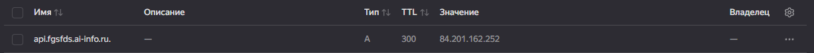
## 7. Проверка DNS
### 07-dig-api
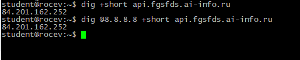
## 8. Конфиг и заглушка API
### 08-api-config
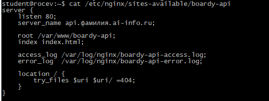
### 09-api-browser
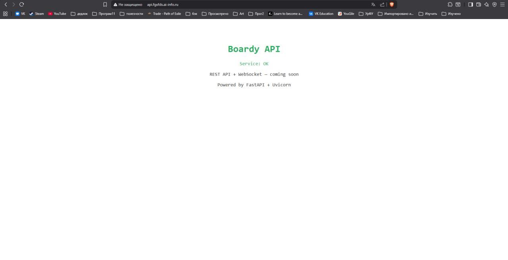

# Часть D. Исследование HTTP
## 9. GET-запрос через curl -v
### 10-curl-v.png
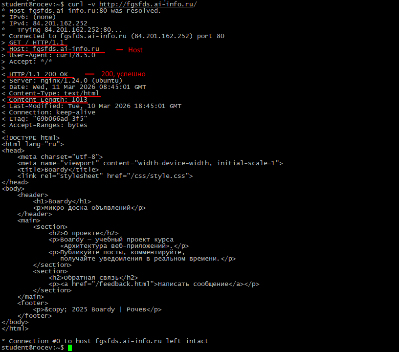
## 10. Виртуальные хосты в действии
### 11-vhosts
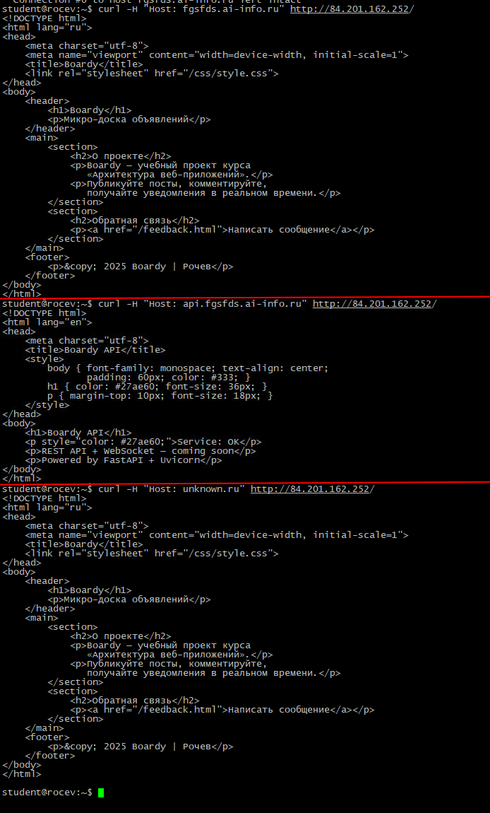\
На одном сервере находится несколько доменов, по имени Host Nginx понимает к какому домену обращается пользователь. 
Третий запрос был перенаправлен на хост по умолчанию (с лендингом).
## 11. POST-запрос
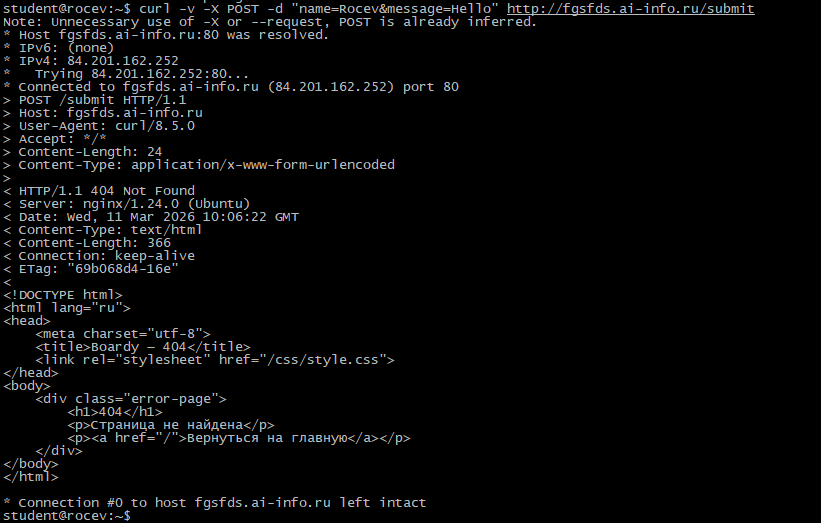\
405 ошибка из-за того, что метод еще не реализован.
### 12-post-405
Get возвращает и заголовки и тело ответа, а Head только заголовки. Head нужен чтобы быстро проверить ответ, не подгружая тело ответа.
# Часть E. Логи
## 13. Раздельные логи
### 13-logs
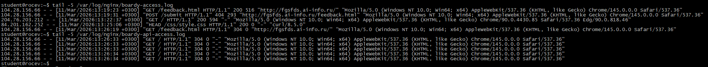
## 14. Фильтрация логов
### 14-log-stats
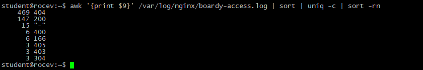
