# Практика 5
# Часть A. HTTPS для основного сайта
## 1. Установка certbot
### 01-certbot-installed
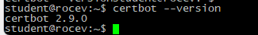
## 2. Установка certbot
### 02-certbot-success
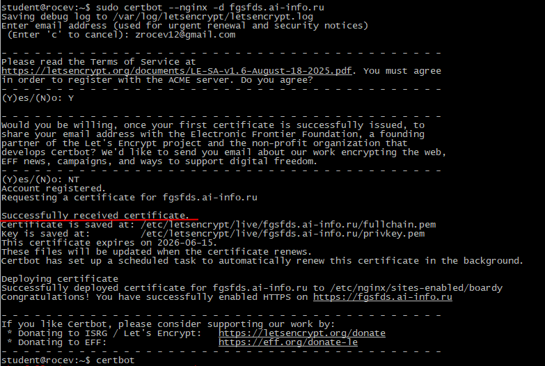\
## 3. Проверка в браузере
### 03-browser-lock
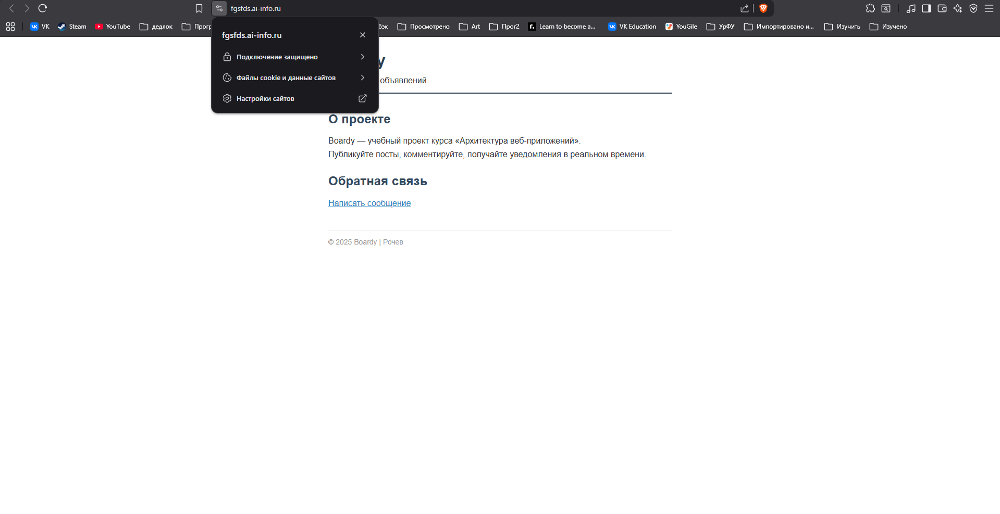
### 04-certificate-info
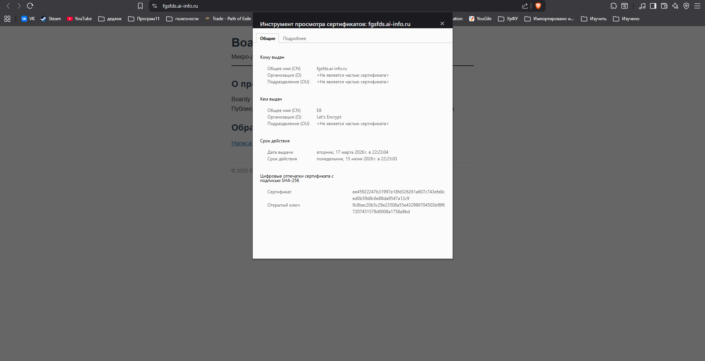
## 4. Редирект
### 05-redirect
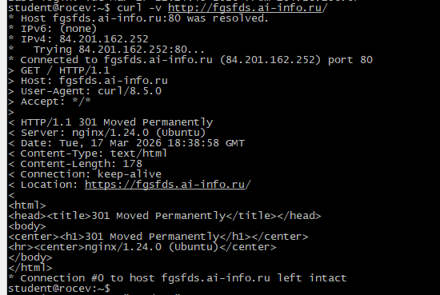
## 5. Конфиг после certbot
### 06-nginx-ssl-config
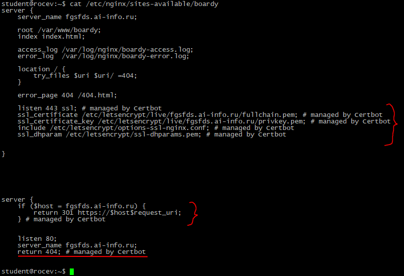

# Часть B. HTTPS для API-сервиса
## 6. Сертификат для api-поддомена
### 07-api-certbot
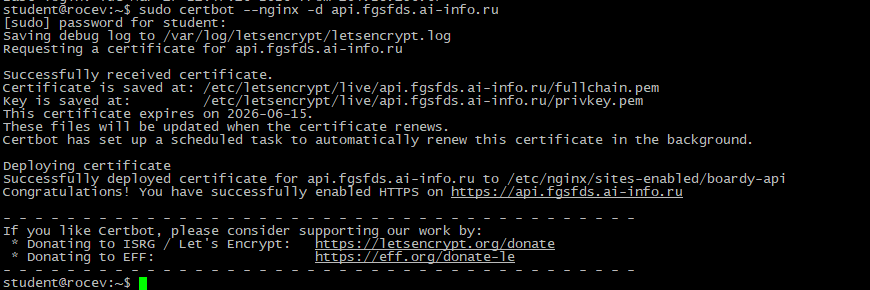
## 7. Проверка обоих доменов
### 08-both-https
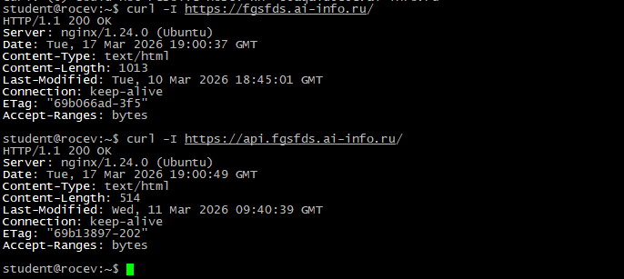

# Часть C. Разбор TLS
## 8. TLS handshake
### 09-tls-handshake
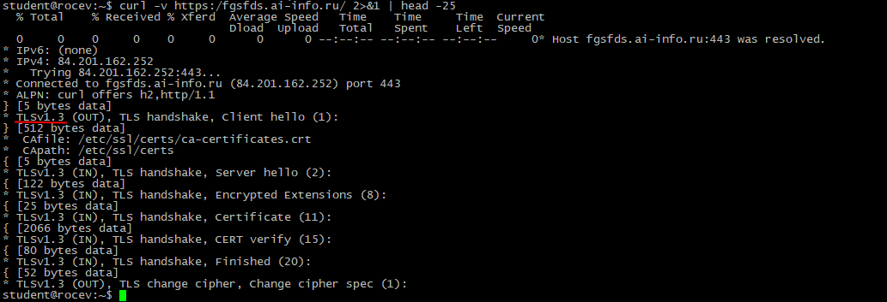
## 9. Цепочка доверия
### 10-chain
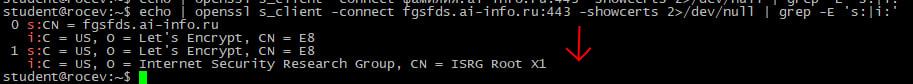\
Цепочка: fgsfds.ai-info.ru > Let's Encrypt > Internet Security Research Group 
Сертификат сайта браузер получает первым, проверяет его, с помощью промежуточного CA. 
Затем проверяет сертификат промежуточного СА с помощью корневого CA. 
Корневой сертификат уже есть в хранилище доверенных корневых CA браузера/ОС. 
Если все подписи верны и сертификаты не истекли, цепочка доверия прошла и проверка успешна. 

## 10. Сравнение сертификатов
### 11-compare-certs
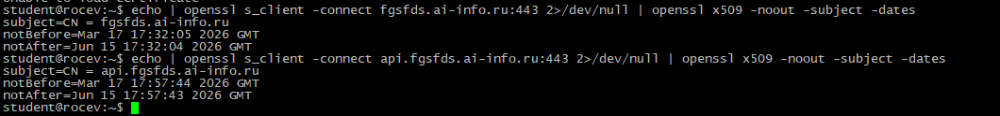\
Общее - издатель. 
Отличаются - домены. 

# Часть C. HSTS, кэширование, gzip
## 11. HSTS
### 12-hsts
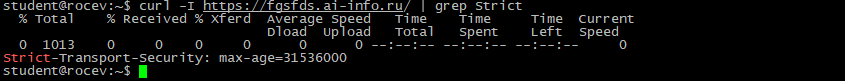\
Что такое HSTS и от чего защищает? 
HSTS это защитная механика, которая заставляет браузер всегда открывать сайт по https. 
Она защищает от подмены протокола (http на https), перехвата cookie файлов. 
### 12. 13-cache-gzip
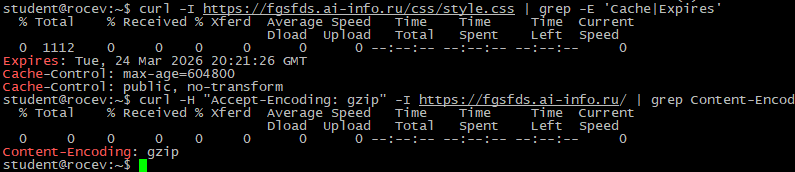\
## 13. Автообновление
### 14-renew
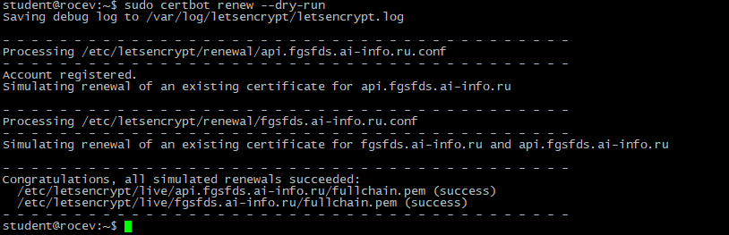
### 15-pull-request
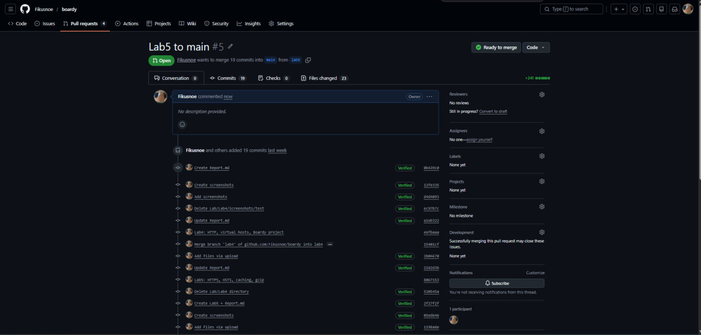
