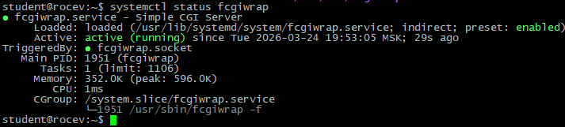
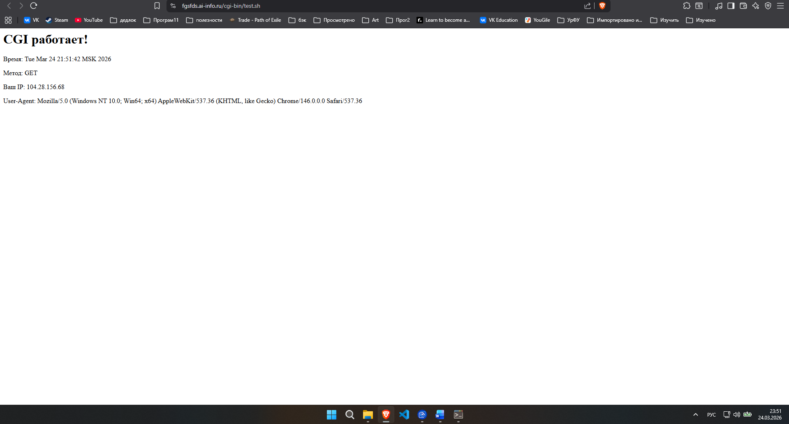
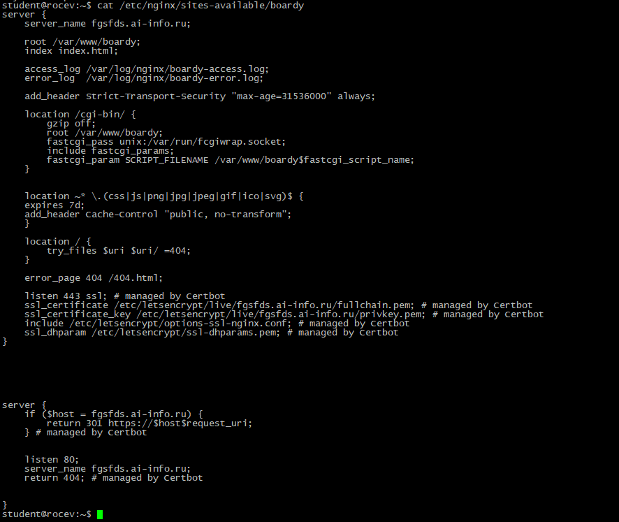
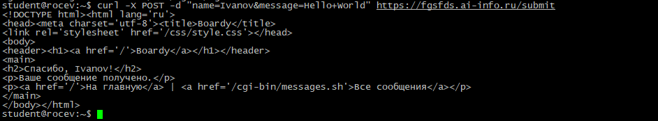
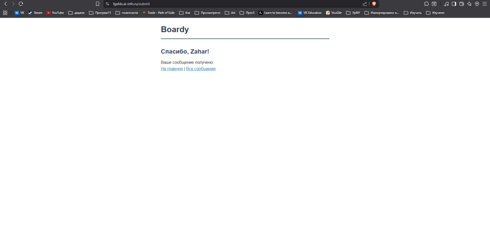
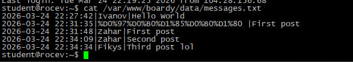
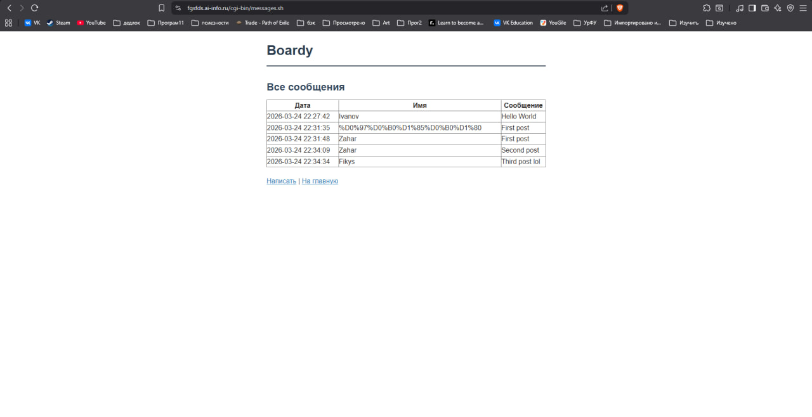
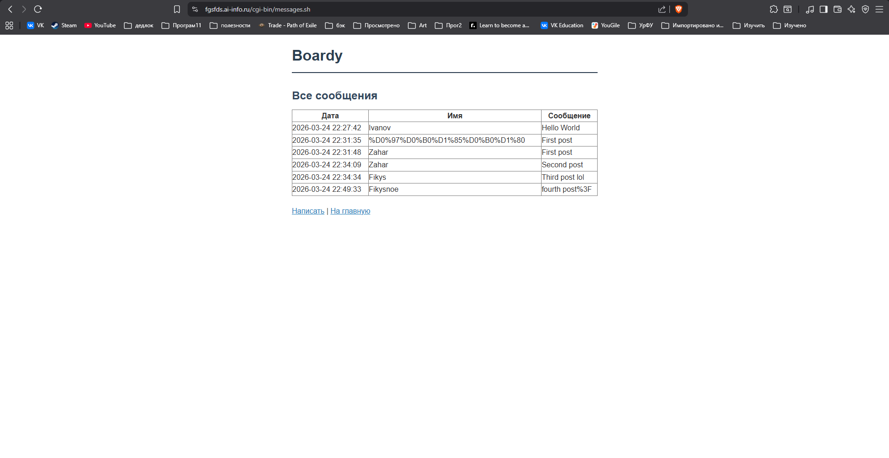
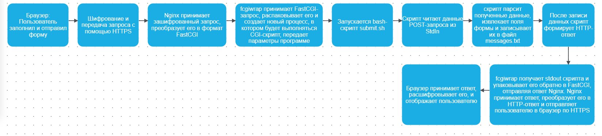
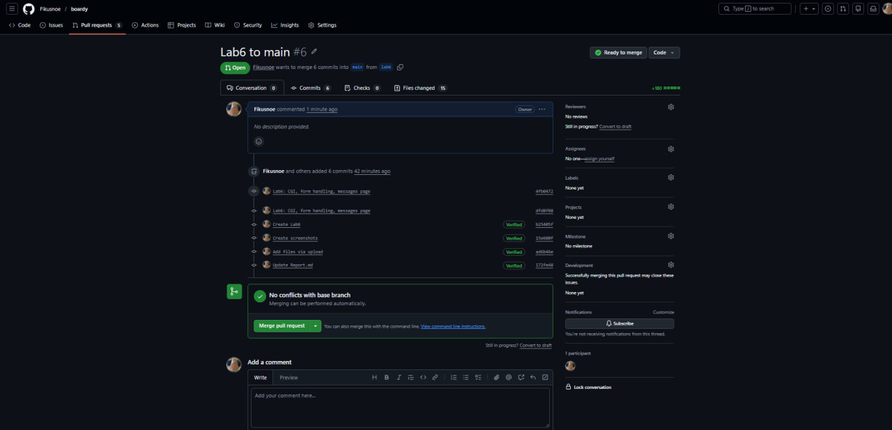

# Практика 6
# Часть A. CGI-скрипт
## 1. Установка fcgiwrap
### 01-fcgiwrap.png

## 2. Тестовый скрипт
### 02-test-cgi.png

## 3. Конфигурация Nginx
### 03-nginx-cgi.png
\
fastcgi_pass unix:/var/run/fcgiwrap.socket; 
Указывает, куда передавать запрос для обработки через FastCGI протокол. 
include fastcgi_params; 
Подключает стандартный файл с набором FastCGI-параметров. 
fastcgi_param SCRIPT_FILENAME /var/www/boardy$fastcgi_script_name; 
Указывает полный путь к исполняемому скрипту. 

# Часть B. Форма Boardy
## 4. Скрипт обработки формы
### 04-curl-submit.png

## 5. Форма в браузере
### 05-form-submit.png

## 6. Данные на диске
### 06-messages-file.png

# Часть C. Страница сообщений
## 7. Проверка обоих доменов
### 07-messages-page.png

## 8. Полный цикл
### 08-full-cycle.png

# Часть D. Анализ
## 9. Путь запроса
### 10-chain

## 10. Теоретические вопросы
1. Что такое CGI и какую проблему он решил в 1993 году?
CGI (Common Gateway Interface) — это стандарт, позволяющий веб-серверу запускать внешние программы (скрипты) и передавать им данные HTTP-запроса. В 1993 году он решил проблему создания динамических веб-страниц, так как до CGI серверы могли отдавать только статический HTML-контент. 
2. Как CGI-скрипт получает данные POST-запроса?
CGI-скрипт получает данные POST-запроса через стандартный поток ввода (stdin). 
3. Почему CGI создаёт проблемы при высокой нагрузке?
Потому что на каждый запрос создается отдельный процесс, что приводит к большим накладным расходам на обслуживание процессов, высокому потреблению памяти и, как следствие, замедлению работы сервера.
Затем проверяет сертификат промежуточного СА с помощью корневого CA. 
4. Чем отличается fastcgi_pass от proxy_pass?
fastcgi_pass проксирует запросы к FastCGI-приложениям по специальному протоколу FastCGI, а proxy_pass проксирует запросы к обычным HTTP-серверам по протоколу HTTP. 
5. Зачем нужен fcgiwrap, если Apache запускает CGI напрямую?
fcgiwrap нужен для Nginx, потому что Nginx не умеет напрямую запускать CGI-скрипты (в отличие от Apache), и fcgiwrap выступает в роли посредника, принимая FastCGI-запросы от Nginx и запуская CGI-скрипты как отдельные процессы. 

### 09-pull-request.png

