# Практика 7
# Часть A. PHP-FPM
## 1. Установка PHP-FPM
### 01-php-version.png
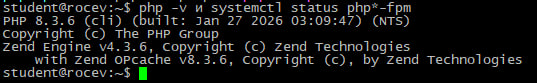
## 2. Форма и сообщения на PHP
### 02-php-form.png
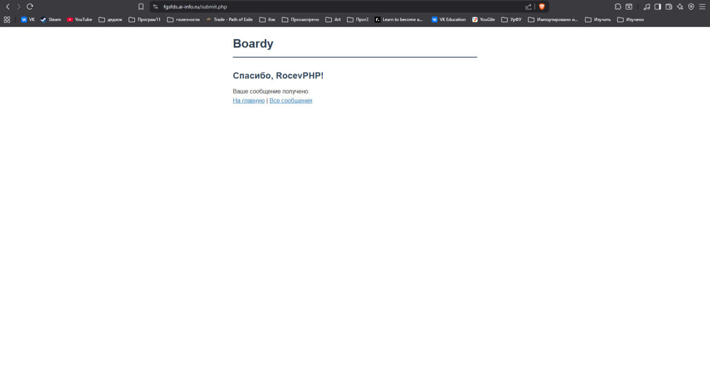
### 03-php-messages.png
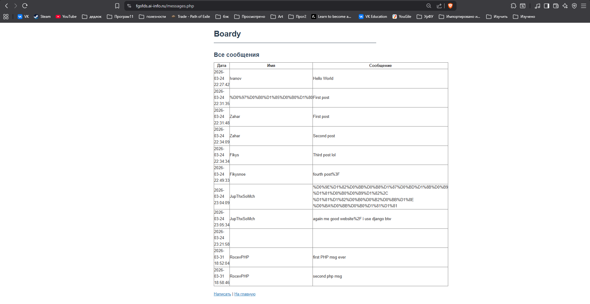
## 3. Конфиг Nginx для PHP
### 04-nginx-php.png
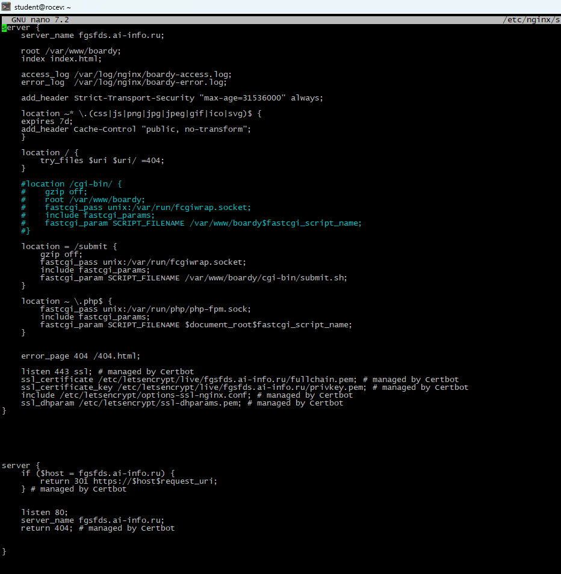\
чем fastcgi_pass отличается от CGI через fcgiwrap? 
fastcgi_pass — это директива, указывающая на FastCGI-сервер, а fcgiwrap — это адаптер, который позволяет запускать старые CGI-скрипты через этот современный протокол. 
Почему PHP-FPM быстрее? 
PHP-FPM - высокооптимизированный FastCGI-сервер для PHP, который изначально создан для высокой производительности. 
## 4. Shared nothing
### 05-shared-nothing.png
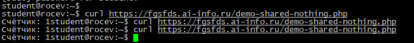\
Почему счётчик не растёт?  
Переменные не живут между запросами. 
Что такое shared nothing? 
Это архитектурный подход, при котором каждый воркер системы работает независимо и не разделяет с другими компонентами никаких ресурсов.
## 5. Блокировка воркеров
### 06-php-slow.png
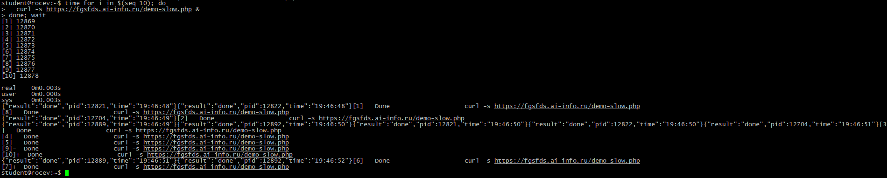

# Часть B. FastAPI
## 6. Установка и приложение
### 07-api-status.png
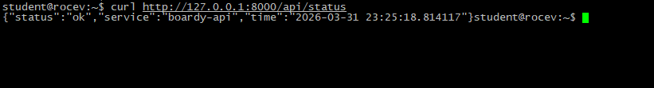
### 08-api-messages.png
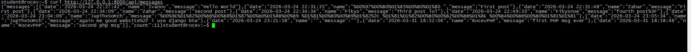
## 7. Живой процесс (счётчик)
### 09-counter.png
\
почему здесь счётчик растёт, а в PHP не рос? 
Uvicorn не уничтожает состояние после запроса.
## 8. Async: 10 запросов за 2 секунды
### 10-async-slow.png
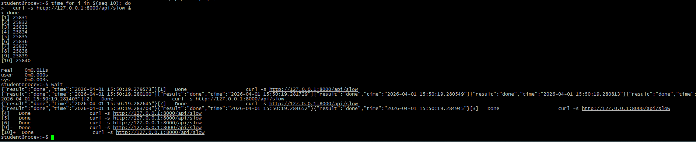\
Почему 10 запросов по 2 секунды заняли ~2, а не 20 секунд? 
Запросы выполняются асинхронно, поток не блокируется и выполняет ещё задачи.
## 9. Блокирующий код убивает event loop
### 11-blocking.png
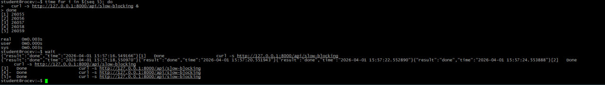\
Чем /api/slow отличается от /api/slow-blocking? Почему время разное? 
slow обрабатывает запросы асинхронно, один за другим без блокировки, а slow-blocking блокирует поток на всё время выполнения каждого отдельного запроса
## 10. Swagger
### 12-swagger.png
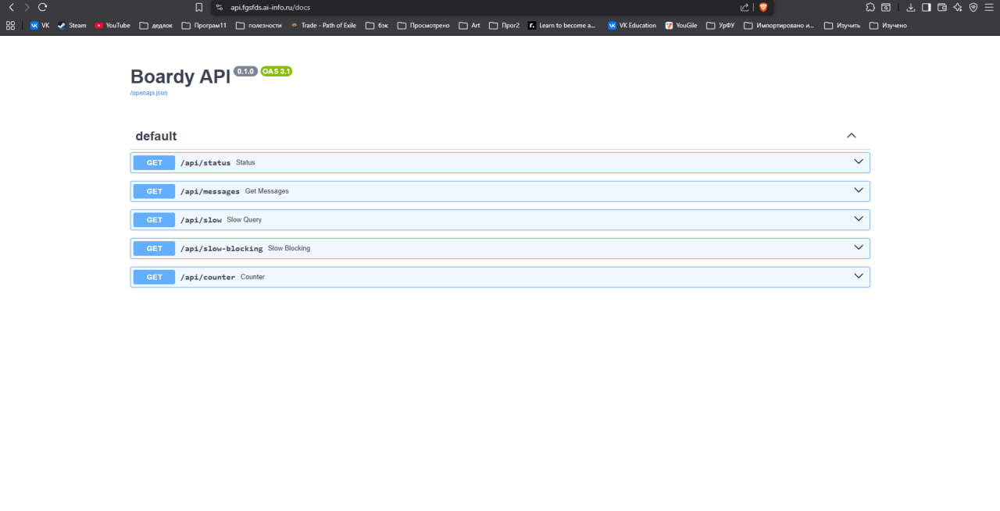
## 11. systemd-сервис
### 13-systemd.png
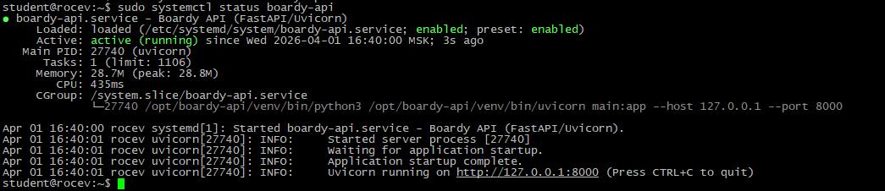
## 12. Nginx proxy_pass
### 14-nginx-api.png
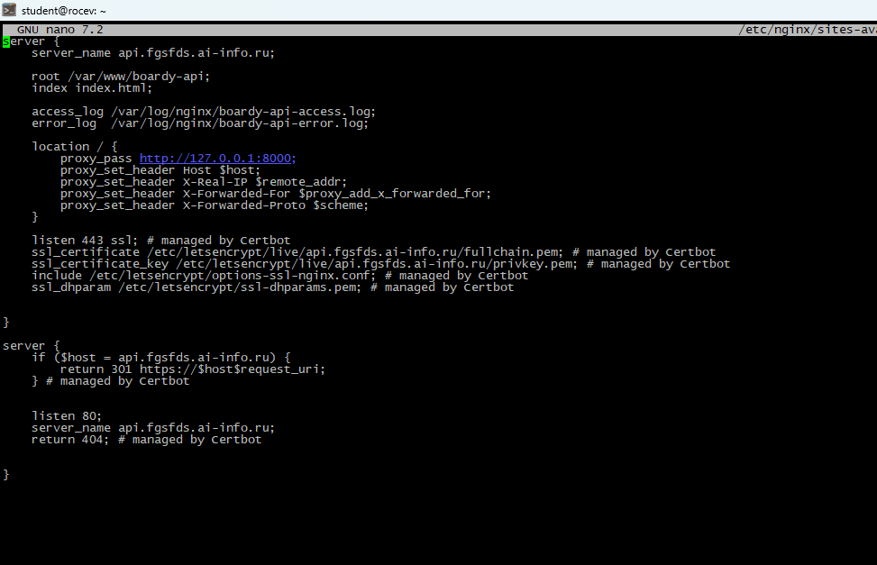\
чем proxy_pass отличается от fastcgi_pass? 
proxy_pass использует HTTP протокол, обратный прокси с другим HTTP-сервером для работы с приложением, когда как fastcgi_pass использует FastCGI протокол для общения с приложением. 
Почему для PHP одно, для Python другое? 
PHP изначально был модулем Apache, FastCGI был способом общения с другими серверами. Для Python стал стандартом WSGI, который позволял серверу и приложению общаться через HTTP с помощью прокси-сервера.

# Часть C. Сравнение
## 13. Два формата
### 15-compare.png (HTML)
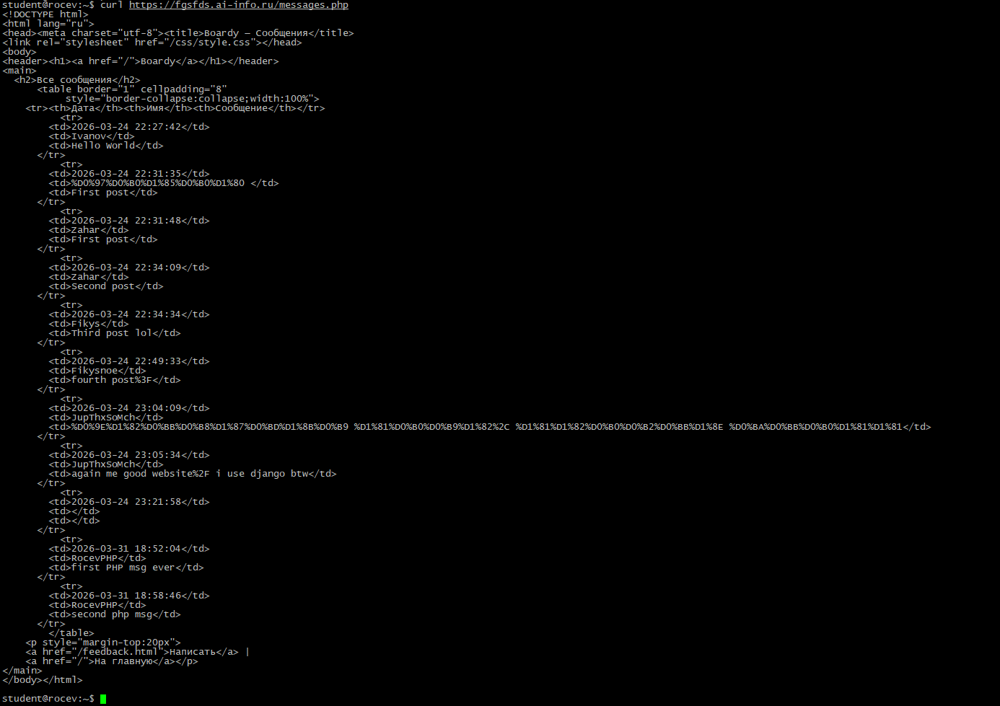
### 15-compare(1).png (JSON)
.png)\
HTML vs JSON 
Одни данные, два формата. Чем отличаются? Для кого каждый? 
HTML - визуальная разметка страницы для человека в браузере. JSON - структурированные данные для программы.
## 14. Процессы
### 16-processes.png (HTML)
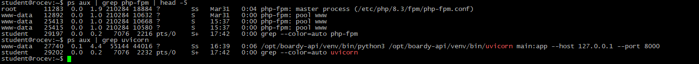

### 17-pull-request.png
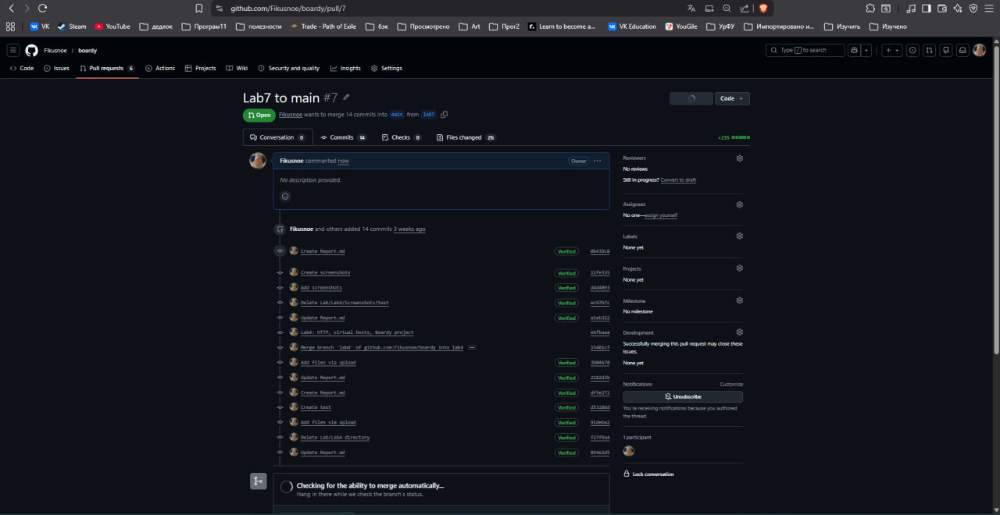
