# Практика 8
# Часть A. MySQL — установка и настройка
## 1. Установка MySQL
### 01-mysql-status.png
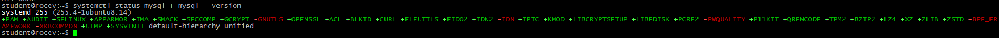
## 2. База данных и пользователь
### 02-db-charset.png
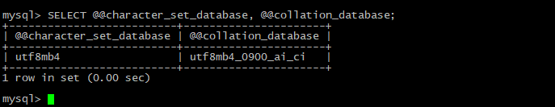\
почему utf8mb4, а не utf8? 
utf8 -  недостаточно, в ней всего 3 байта, не поддерживаются эмодзи. В utf8mb4 поддерживаются все языки, эмодзи, именно это является стандартом. 
Что такое collation и зачем unicode_ci? 
Collation - способ сравнения, unicode_ci - нужен для точного сравнения по Unicode правилам. 
## 3. phpMyAdmin
### 03-phpmyadmin.png
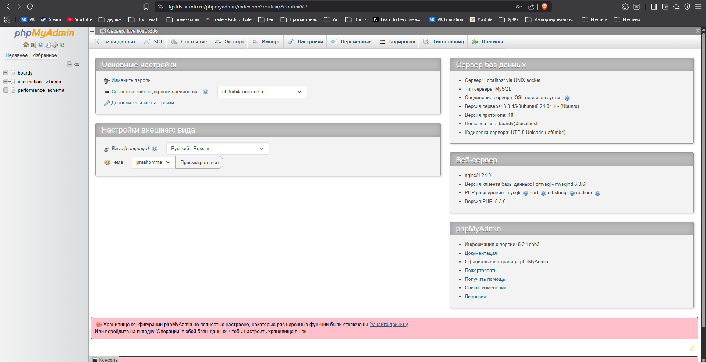

# Часть B. Таблицы и связи
## 4. Три таблицы
### 04-tables-cli.png
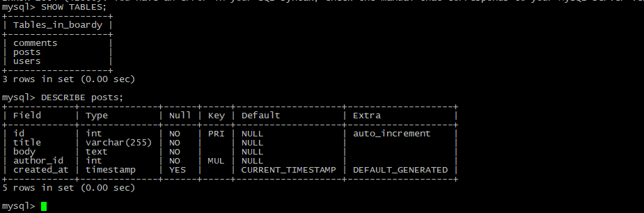
### 05-tables-pma.png
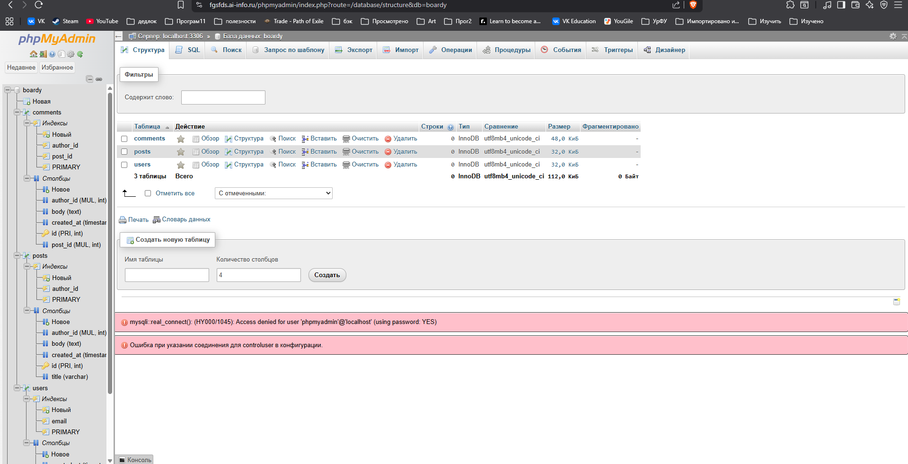\
что такое FOREIGN KEY и ON DELETE CASCADE? 
FOREIGN KEY — это связь между двумя таблицами, которая обеспечивает целостность данных. Она гарантирует, что значение в одной таблице существует в другой таблице. 
ON DELETE CASCADE — это правило, которое говорит: "Когда удаляешь запись из главной таблицы — автоматически удали все связанные записи из дочерней" 
Зачем? 
Для связи между таблицами и чтобы не оставалось старых данных, которые должны быть обновлены вместе с родительскими данными. 
Какой движок используется и почему? 
InnoDB по причине ACID-совместимости и обработки конкурентного доступа. 
## 5. SQL-скрипт
### 06-schema-sql.png
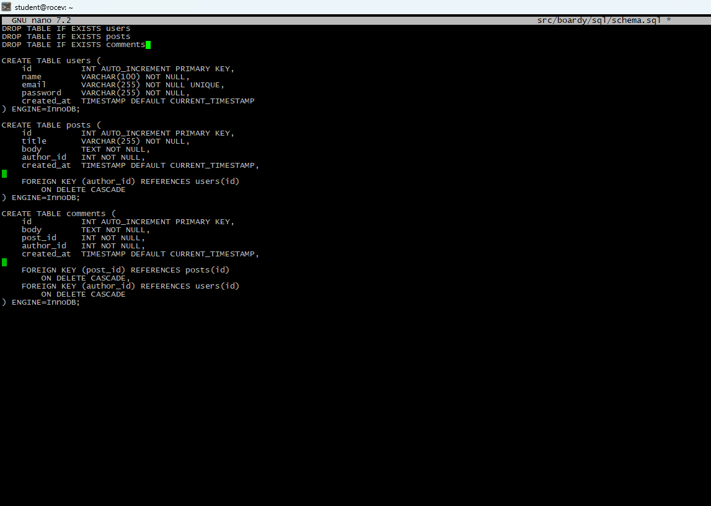

# Часть C. SQL — базовые операции
## 6. INSERT
### 07-data-cli.png
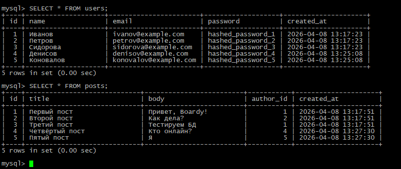
### 08-data-pma.png
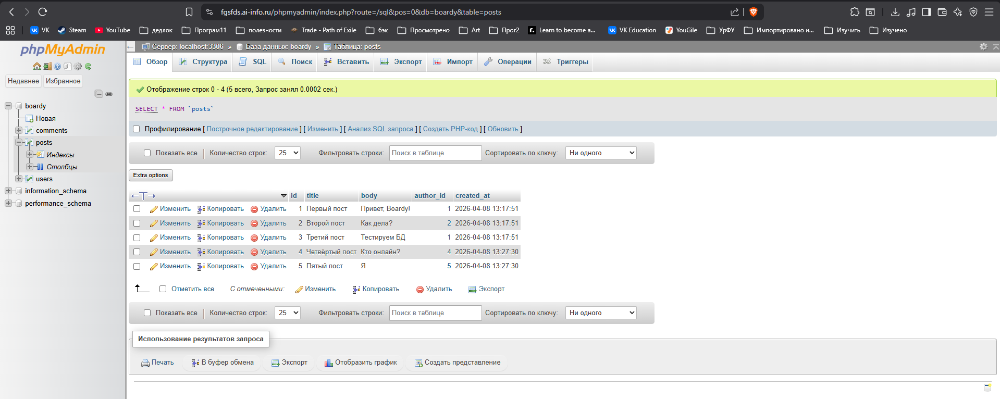
## 7. SELECT + JOIN
### 09-join.png 
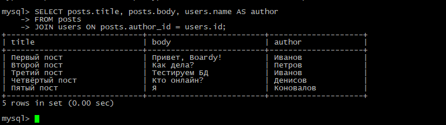\
зачем JOIN? 
JOIN позволяет сопоставить строки из одной таблицы со строками другой таблицы по заданному правилу сопоставления, получив на выходе новую таблицу. 
Как получить имя автора без него? 
Можно написать подзапрос в скобках. 
## 8. Foreign Key — защита целостности
### 10-fk-error.png

## 9. CASCADE
### 11-cascade.png
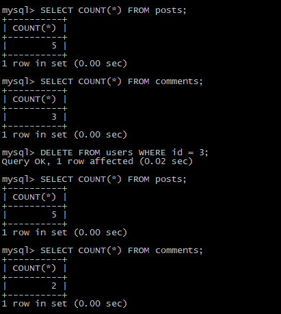
## 10. SQL-инъекция
### 12-injection.png
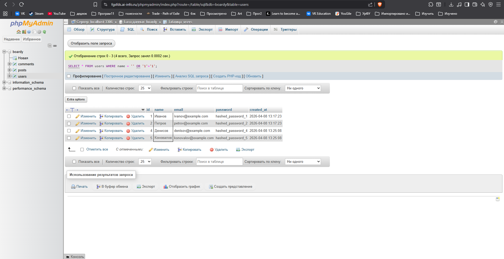\
как работает SQL-инъекция? 
SQL-инъекция - это атака, при которой пользователь внедряет SQL-код в приложение через код или запрос. 
Как prepared statement защищает? 
Prepared Statement разделяет SQL-код и данные. Данные никогда не интерпретируются как SQL-команды. 
## 11. db.php
### 13-db-php.png
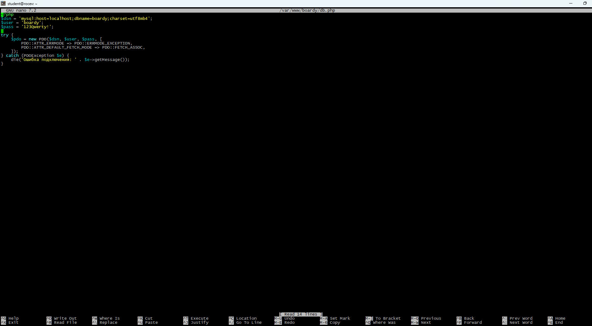
## 12. submit.php через MySQL
### 14-submit.png
\
### 15-submit-pma.png

## 13. messages.php через MySQL
### 16-messages.png
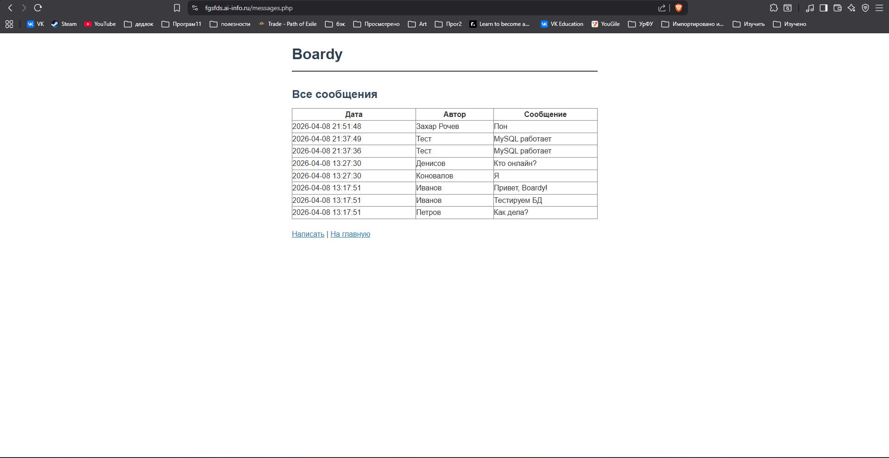

# Часть E. FastAPI + MySQL
### 17-api-messages.png
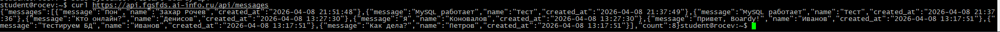
### 18-api-users.png
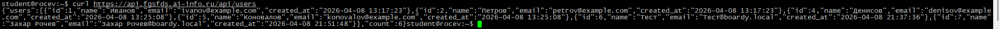\
почему aiomysql, а не обычный mysql-connector? 
aiomysql асинхронен, mysql-connector - нет. 
Что будет с event loop при синхронном драйвере? 
Event Loop заблокируется. 
