# Практика 9
# Часть A. REST API
## 1. Структура проекта
### 01-tree.png
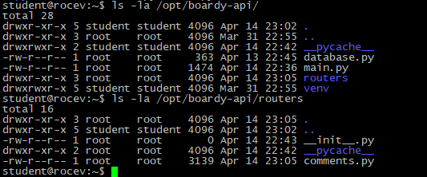
## 2. GET — список комментариев
### 02-get.png
\
Какой SQL-запрос выполняет этот эндпоинт? 
Select из таблицы комментариев с Join имён авторов 
Зачем JOIN? 
Join нужен, чтобы к каждому комментарию в таблице комментариев сопоставить имя автора. 
## 3. POST — создать комментарий
### 03-create.png
\
Почему 201, а не 200? 
201 - статус успешного создания нового объекта. 200 - просто для успешных операций, которые ничего не создают. 
Что означает Content-Type: application/json? 
Это заголовок, который означает, что переданные данные будут в формате JSON. 
## 4. PUT — редактировать
### 04-update.png
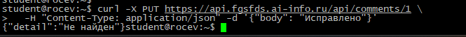\
Чем PUT отличается от POST? 
PUT - обновляет существующий объект, POST - создаёт новый. 
Почему URL другой (/comments/{id}, а не /posts/{id}/comments)? 
URL для PUT указывает на уже существующий комментарий (объект) в таблице комментариев, когда как для POST он указывает на комментарии к отдельному посту. 
## 5. DELETE — удалить
### 05-delete.png
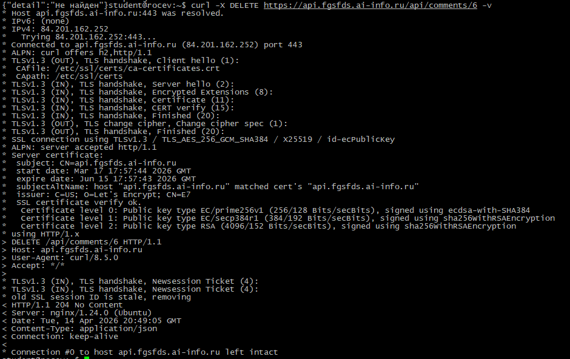\
Перечислите 4 HTTP-глагола.  
GET, POST, PUT, DELETE. 
Какой код ответа у каждого и почему? 
GET - 200, успешно найден. 
POST - 201, успешно создан. 
PUT - 200, успешно обновлён. 
DELETE - 204, успешно удалён, нет контента. 
## 6. Ошибки
### 06-errors.png
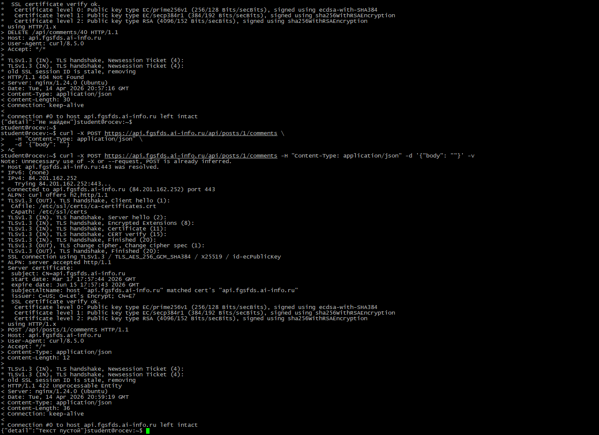\
чем 404 отличается от 422? 
404 - ошибка, возникающая когда запрашиваемый объект недоступен или не существует. 422 - ошибка валидации данных при запросе. 
## 7. Swagger
### 07-swagger.png
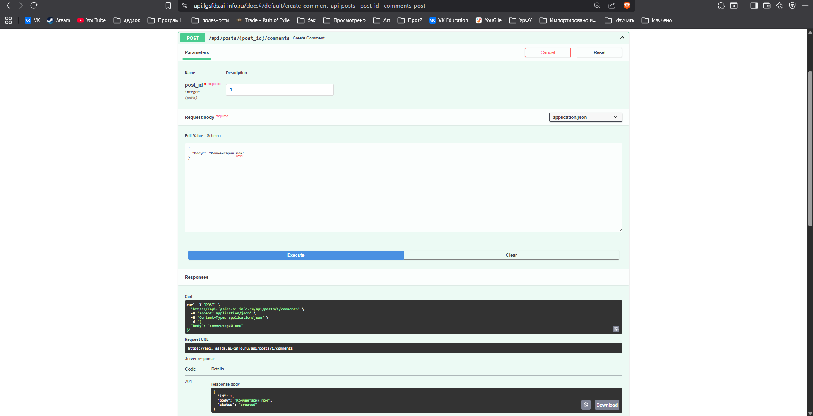

# Часть B.  JavaScript-клиенты
## 8. Vanilla JS — демо
### 08-vanilla.png
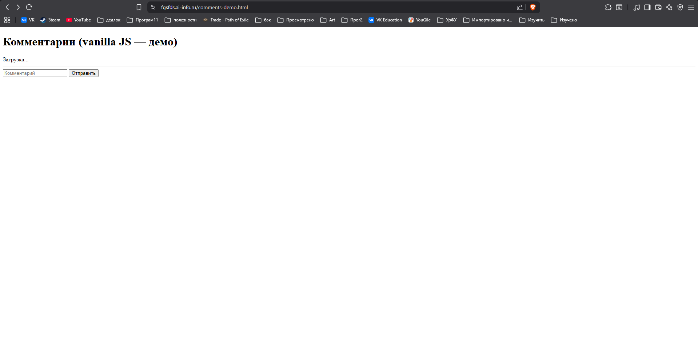\
Что делает функция esc()? 
Экранирует ввод пользователя. 
Что случится если её не вызвать? 
Если не вызвать эту функцию, вводимый пользователем текст не будет экранироваться и пользователь сможет провести XSS атаку на сайт. 
## 9. React — полный CRUD
### 09-react-list.png
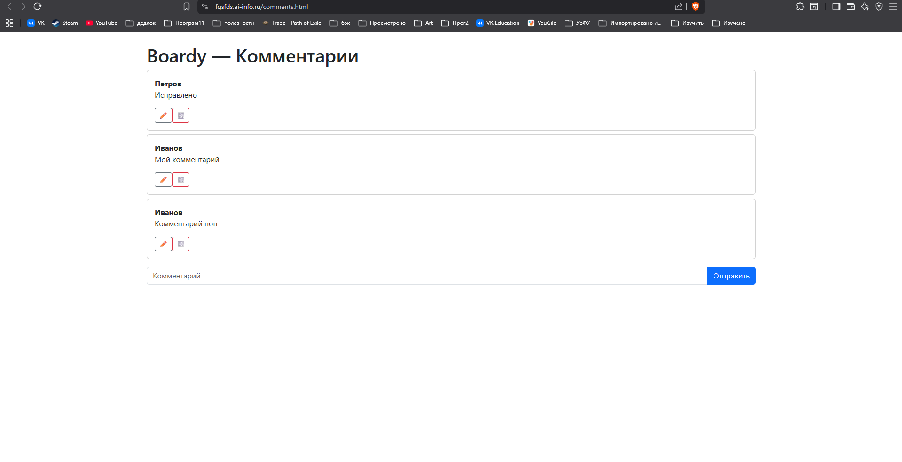
### 10-react-edit.png
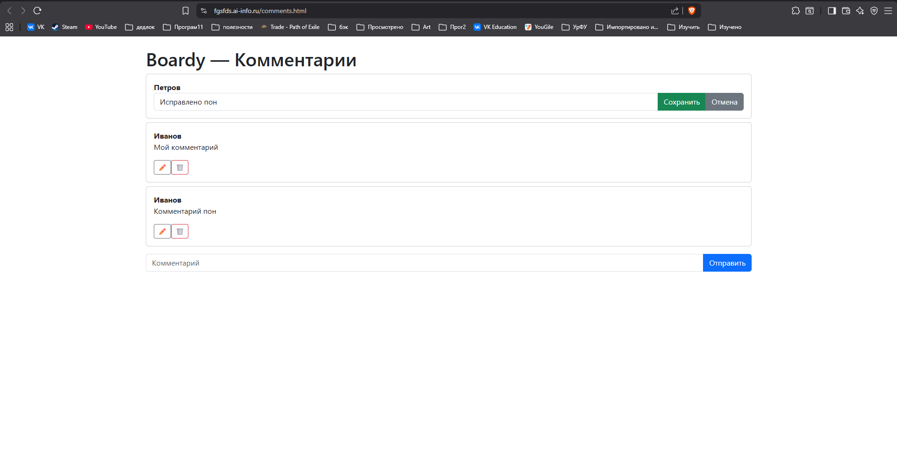
### 11-react-delete.png
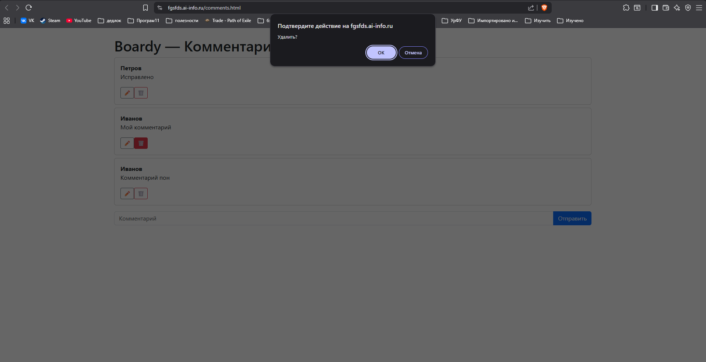
## 10. Сравнение кода
Сравните vanilla JS и React по пунктам: 
— Где хранится состояние (список комментариев, текст формы)? 
В vanilla JS состояние хранится в DOM и глобальных переменных: список комментариев в переменной data, текст формы читается напрямую из поля ввода. В React всё состояние централизовано в хуках useState это список в items, текст формы в text, ID редактируемого комментария в editId 
— Как обновляется список после добавления? 
В vanilla JS после отправки комментария нужно вручную вызвать loadItems(), которая формирует HTML-строку и вставляет её через innerHTML, полностью перерисовывая список, а в React достаточно вызвать setItems(data.items): React сам сравнивает виртуальный DOM и обновляет только изменившиеся элементы. 
— Как реализовано редактирование? 
В vanilla JS редактирование требует ручного перестраивания DOM , а в React редактирование реализовано через условный рендер: одна условная конструкция позволяет автоматически переключатся между просмотром и редактированием. 
— Как защищаемся от XSS? 
В vanilla JS нужно вручную вызывать функцию esc() для каждого выводимого поля,если забыть - дыра в безопасности. React автоматически всё экранирует. 
## 11. DevTools → Network
### 12-network.png
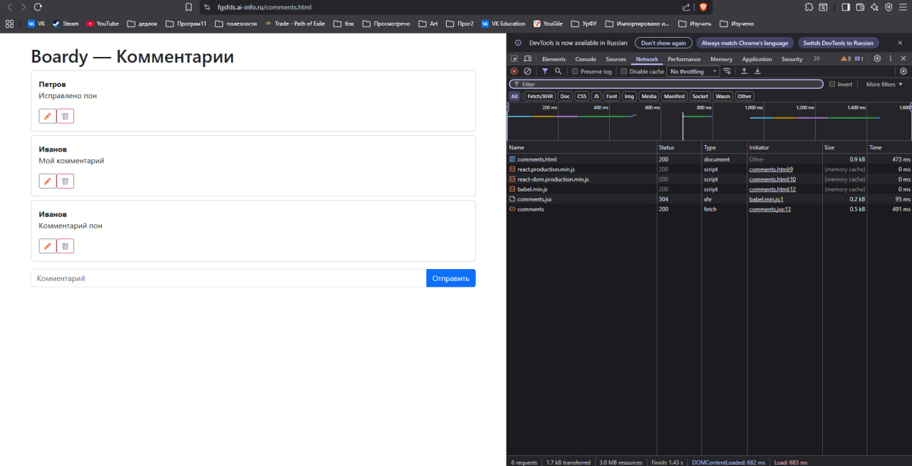\
Сколько запросов? 
6 запросов 
Какой из них — к API? 
comments - fetch 

# Часть C. SQL — базовые операции
## 12. View Source
### 13-source-ssr.png
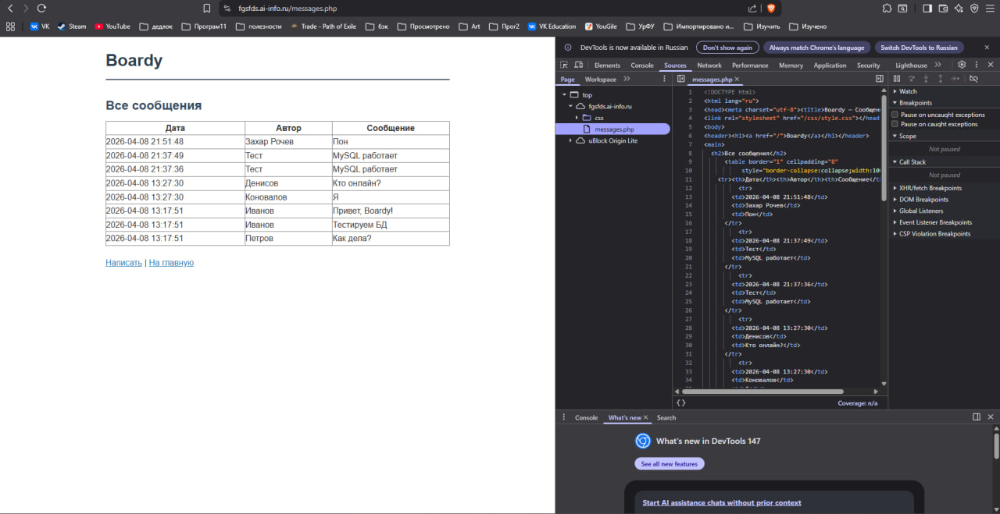
### 14-source-csr.png
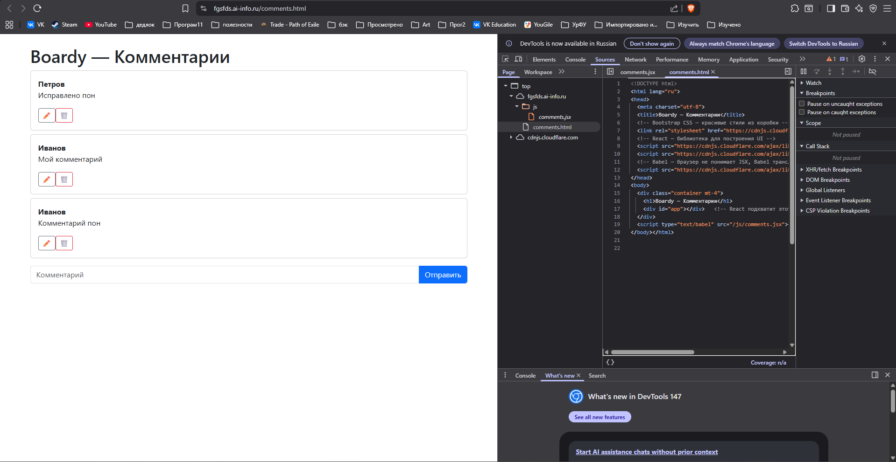
## 13. XSS
### 15-xss.png
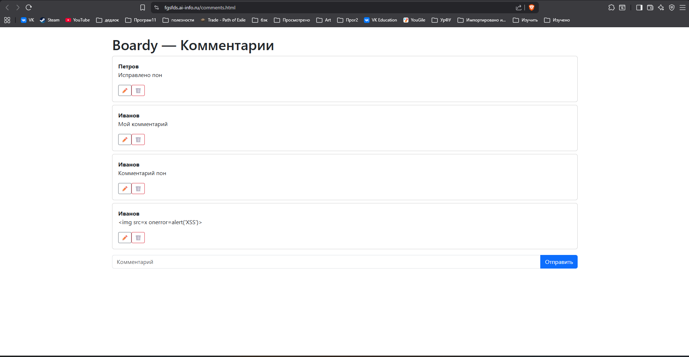\
Как vanilla JS и React защищаются от XSS? 
В vanilla JS нужно вручную вызывать функцию esc() для каждого выводимого поля,если забыть - дыра в безопасности. React автоматически всё экранирует. 
Какой способ надёжнее? 
Безусловно способ React'а надёжнее, так как каждый текст экранируется, банально невозможно забыть защититься от XSS. 
## 14. Итоговая таблица
### Таблица
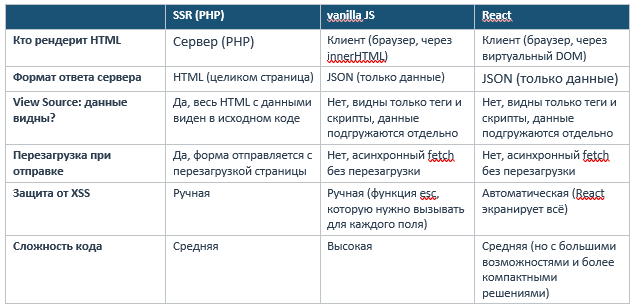
